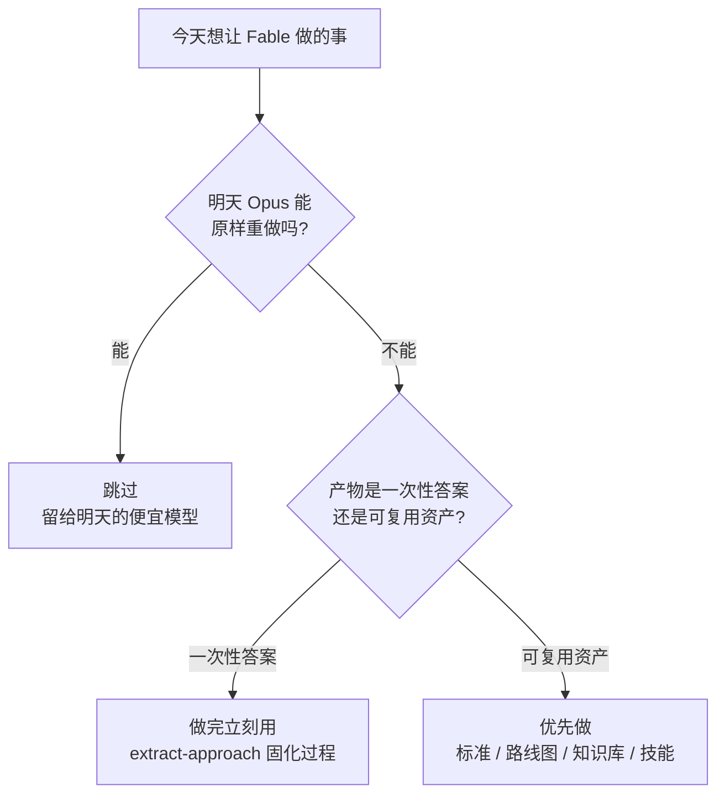

# Fable 5 Extraction Playbook · 最后一天提取手册

> **来源与声明**：本文基于 Machina (@EXM7777) 于 2026-07-05 ~ 07-07 前后发布的 X 长文
> （"Do this on your last day with Fable"）整理、扩写，并针对 Jarvis-Workshop 的实际项目
> （Jarvis-HEP-v2、micrOMEGAs 7 fork、Jarvis-Books 手册、Jarvis-Docs）做了定制。
> 原文的前提是：**Fable 5 即将退出包月订阅、转为按 token 计费**——这是博客的说法，
> 具体价格与时间以 Anthropic 官方公告为准（<https://www.anthropic.com/news/claude-fable-5-mythos-5>）。
> 但方法论本身**不依赖这个日期**：任何"前沿模型窗口"（新模型限时可用、降价试用、
> 即将退役）关闭之前，这套流程都原样适用。
>
> 文中所有 prompt 保持英文（直接粘贴给模型效果最稳）；叙述用中文。
> 无法独立核实的原文数据在 [§9 事实核查](#9-安全成本与事实核查) 中单独标注。

---

## 目录

- [0. TL;DR：一页纸版本](#0-tldr一页纸版本)
- [1. 背景：为什么核心动作是"提取"而不是"使用"](#1-背景为什么核心动作是提取而不是使用)
- [2. 唯一的测试：不可逆性过滤器](#2-唯一的测试不可逆性过滤器)
- [3. 工作流一：把 Fable 的判断力种进工作区](#3-工作流一把-fable-的判断力种进工作区claudemd--skills)
- [4. 工作流二：请不起的顾问——业务/科研审计](#4-工作流二请不起的顾问业务科研审计)
- [5. 工作流三：第二大脑——深度研究 → 原子化知识库](#5-工作流三第二大脑深度研究--原子化知识库)
- [6. 工作流四：/goal 与动态工作流——花掉无人值守的小时](#6-工作流四goal-与动态工作流花掉无人值守的小时)
- [7. 工作流五：extract-approach——记录 Fable 怎么想](#7-工作流五extract-approach记录-fable-怎么想)
- [8. 执行计划：1 小时 / 半天 / 全天](#8-执行计划1-小时--半天--全天)
- [9. 安全、成本与事实核查](#9-安全成本与事实核查)
- [10. 窗口关闭之后](#10-窗口关闭之后)
- [附录 A：全部 prompt 速查表](#附录-a全部-prompt-速查表)
- [附录 B：模板文件](#附录-b模板文件)

---

## 0. TL;DR：一页纸版本

**一句话**：不要把前沿模型的最后一天花在"用它干活"上，要花在"让它把判断力写下来"上——
写下来的东西（标准、路线图、知识库、技能）在模型消失后仍然全值运转。

**唯一的测试**：*明天换一个更便宜的模型，能把这件事重做出来吗？*
能 → 别做。不能 → 今天做。

**五个动作**（按"时间不够先做哪个"排序）：

| # | 动作 | 留下的资产 | 时间不够时的优先级 |
|---|------|-----------|:---:|
| 5 | 安装 `extract-approach` 技能 + CLAUDE.md 学习法则 | 每个解题过程自动变成 learnings 笔记 | **1**（先装，之后全天自动增值） |
| 4 | `/goal` + 后台子代理跑最高价值的积压任务 | 完成的工作 + 粘贴在对话里的证据 | **2**（装完就让它自己跑） |
| 1 | 让 Fable 重写每个项目的 CLAUDE.md + 3 个技能 | 可检查的质量标准层 | **3** |
| 2 | 顾问式全盘审计 | 弱模型可执行的排序路线图 | **4** |
| 3 | 深度研究 → Obsidian 原子笔记 | 可检索复用的知识库 | **5** |

**两条铁律**（针对无人值守运行）：
1. 完成条件里必须要求**把证据粘贴进对话**（测试绿灯输出、构建日志），因为裁判模型只读对话、不能跑你的代码；
2. 每个运行必须写死**上限**（回合数或墙钟时间），没有上限的循环就是没有上限的账单。

---

## 1. 背景：为什么核心动作是"提取"而不是"使用"

### 1.1 前提（博客的说法）

- Fable 5 是 Anthropic Claude 5 家族中 Mythos 级的旗舰模型，能力档位在 Opus 之上；
- 博客称：自某日起它退出包月订阅、只能按 token 计费——对普通订阅用户来说等于"没了"；
- 因此"最后一个包月日"是**以固定成本调用最强判断力的最后机会**。

即使上述时间表有出入，历史模式是真实的：**前沿模型会被重新定价、下架、
有时短暂复活、最终退役**。你没有及时保存的输出，在它下线后无法重建。

### 1.2 先例：老师死了，学生还在跑

LLaMA 时代被复制最多的训练数据集（Stanford Alpaca，2023）就是从一个前沿模型
（OpenAI text-davinci-003）里抽取 **52,000 条问答**、总生成成本 **不到 500 美元**
训练出来的。那个前沿模型后来退役了——**老师死了，但所有从它身上蒸馏出来的东西
至今还在运行。**

这就是今天的策略原型：**蒸馏（distillation），而不是对话（conversation）**。
区别在于产物：

| 对话模式 | 提取模式 |
|---------|---------|
| 得到一个答案，用一次 | 得到一个**标准**，升级之后的每一个答案 |
| 价值随会话结束归零 | 价值在模型下线后不变 |
| 需要 Fable 级智能来**使用** | 只需要 Fable 级智能来**创建**，普通智能即可**使用** |

### 1.3 能穿越模型换代的四类资产

1. **标准（standard）**——写成可检查条款的质量门槛、约定、禁区；
2. **路线图（roadmap）**——推理过程已经写在纸面上的决策序列；
3. **知识库（vault）**——已经蒸馏成原子笔记、可被任何模型检索的研究结论；
4. **技能（skill）**——自动触发、不依赖你记得去用的固化流程。

本手册的五个工作流，一一对应地生产这四类资产（工作流 4 生产的是
"已完成的工作 + 证据"，属于直接消费额度而非资产，所以要用两条铁律看住它）。

---

## 2. 唯一的测试：不可逆性过滤器

对今天想做的每一件事，先问：

> **"明天换一个更便宜的模型（Opus / Sonnet），能把这件事重做出来吗？"**



### 2.1 判例表（通用 + 本工作区）

| 事项 | 判定 | 理由 |
|------|:---:|------|
| 建一个网站 / demo app | ❌ 跳过 | Opus 下周免费重建 |
| 批量生成一个月的内容 | ❌ 跳过 | 中档模型的活 |
| 写一个画图脚本、常规 Python 工具 | ❌ 跳过 | Sonnet 就够 |
| 重写 Jarvis-HEP-v2 的 CLAUDE.md 成"弱模型操作手册" | ✅ 做 | 质量标准只有强模型能**制定**，弱模型只能**执行** |
| 审计整个 Workshop、给出带完整推理的路线图 | ✅ 做 | 推理今天写在纸上，明天 Opus 照单执行 |
| 对 micrOMEGAs fork 的物理修改做架构级审查并写下规则 | ✅ 做 | Grok 写的未审查代码 + 物理正确性判断，正是 Fable 级任务 |
| 把悬而未决的物理决策（如 inelastic DD 截面侧怎么补全）推理清楚并写成文档 | ✅ 做 | 弱模型给不出这个推理，但能照着写好的方案实现 |
| 跑 `latexmk` 修编译错误 | ❌ 跳过 | 机械活 |
| 深度调研 + 蒸馏成原子笔记（如低能区 R(s) 数据处理的文献综述） | ✅ 做 | 长链条多步综合是 Fable 相对其他模型最大的优势区 |

**用外科医生量血压**——这是原文对"拿最后的前沿时长做中档任务"的比喻。牢记。

---

## 3. 工作流一：把 Fable 的判断力种进工作区（CLAUDE.md + Skills）

### 3.1 原理

前沿模型留下的最高价值产物是**标准**：一个答案帮你一次，一条标准升级之后的
每一个答案。CLAUDE.md、`.claude/skills/`、learnings 文件、memory——这是**每个
未来模型在碰你的代码之前都会先读的一层**。今天让 Fable 来写这一层，就是让
之后所有便宜模型戴着 Fable 的眼镜干活。

**为什么便宜模型做不到**：弱模型发明不出质量门槛，但它能不折不扣地执行一份
写好的质量门槛。所以关键是把"好"从形容词翻译成**可检查的条款**。

反例与正例：

```text
❌ 形容词式（没用）:  "测试要全面，文档要清晰"
✅ 条款式（可检查）:  "新模块合入前必须有: (a) 覆盖失败路径的单元测试;
                     (b) YAML_REFERENCE_2.0.md 中的对应条目 + 可运行示例;
                     (c) docs strict-build 通过, 输出贴在 PR 里"
```

### 3.2 通用 prompt（原文，直接可用）

在**每个你在乎的项目**里各跑一遍：

```text
read this entire project and how i work in it

then rewrite my CLAUDE.md as the operating manual a less capable model would
need to work here at your level:

> the conventions i follow and the ones you'd add
> the mistakes a weaker model will make in this codebase, named, with the rule
  that prevents each
> the quality bar per deliverable, written as checkable criteria, not adjectives
> what to do when uncertain: the exact escalation rules

then propose the 3 skills that would save me the most hours, and write them in full
```

### 3.3 定制版 · Jarvis-HEP-v2

```text
read this entire repository, plus the design docs in ../Jarvis-Books/Docs
(YAML_REFERENCE_2.0.md, INSTALL.md, and the Agent-Bridge design doc), and run
the test suite once to see the 207 tests pass.

context you must weigh: a large fraction of this code was machine-generated
and has never been human-reviewed. green tests prove the happy path, not the
design.

then rewrite CLAUDE.md as the operating manual a less capable model would need
to work here at your level:

> the conventions the codebase ACTUALLY follows (inferred from the code), and
  the ones you would add — separate the two lists
> the mistakes a weaker model will make HERE, named, each with the rule that
  prevents it. think: YAML schema drift vs YAML_REFERENCE_2.0.md, sampler
  edge cases, silent unit/convention mismatches in physics quantities,
  breaking the Agent-Bridge (D8 <-> hep_* tools) contract
> the quality bar per deliverable as checkable criteria, not adjectives —
  one block each for: new module, bug fix, config-schema change, docs change
> exact escalation rules: the specific situations where the model must stop
  and ask instead of guessing (e.g. anything that changes physics output)

then propose the 3 skills that would save the most hours in this repo, and
write them in full under .claude/skills/
```

### 3.4 定制版 · micrOMEGAs 7 fork

这个仓库的"弱模型必踩的坑"已经用血泪验证过了，直接喂给 Fable 让它编纂成规则：

```text
read main.cpp, include/micromegas_json.hpp, directDet.c, lib/improveCS.c, and
the surrounding build setup.

known landmines that a weaker model WILL step on — encode each one as an
explicit rule with a one-line WHY:
- new projects are C++-only and default to JSON I/O via main.cpp +
  include/micromegas_json.hpp (nlohmann); do not regress to the stock C flow
- the macOS complex.h / extern "C" interaction: name the failure mode and the
  required include/linkage pattern
- nextOdd is 0-indexed
- DeltaDD: global in directDet.c, default 0 = elastic; ONLY the kinematics
  (v_min) side is implemented — the cross-section side is deliberately
  deferred; a weaker model must not "helpfully" invent it
- the R(s) hadronic correction lives in lib/improveCS.c as an override, is
  relic-density-only, and is gated on T>0; sigma_mumu is auto-tabulated

rewrite CLAUDE.md as the operating manual for this fork at your level:
conventions, the landmine rules above plus any you find yourself, checkable
quality bars (a physics change ships with: the expected numerical shift on a
reference point, stated; a regression comparison against unmodified upstream;
the config switch documented), and exact escalation rules (any change that
moves a computed observable must be flagged, never silently merged).
```

### 3.5 定制版 · Jarvis-Books / Jarvis-Docs（文档层）

```text
read the docs tree and the existing conventions: asides use <aside> blocks
(never !!! admonitions), raw-HTML links must use the ../page/ form, all
content is English-only, and `mkdocs build --strict` must pass.

rewrite the docs CLAUDE.md so a weaker model can extend these docs without
breaking them: the conventions as hard rules with the failing symptom named
(what strict-build error each violation produces), the quality bar for a new
page (checkable), and a pre-commit checklist the model must run.
```

### 3.6 验收标准（这一步做没做好，怎么判断）

- [ ] 每条规则都**可判定**：一个不认识你的人能对照它打 ✓/✗；
- [ ] "弱模型会犯的错"是**具名的**（有文件、有符号、有失败症状），不是泛泛的"注意边界情况"；
- [ ] 升级规则写明**触发条件**（"改动会影响物理输出时"），不是"不确定时问我"；
- [ ] 3 个技能是**完整写出的** SKILL.md，不是标题清单。

---

## 4. 工作流二：请不起的顾问——业务/科研审计

### 4.1 原理

博客给出的定位：Fable 的已验证优势是**对困难、混乱问题的判断力**（原文称在最难
一档编码基准上得分超过次席模型两倍以上，且难度越高差距越大——此数据未独立核实，
见 §9）。所以把你拥有的最难最混乱的问题交给它：**你的全部工作本身**。

**交付物法则**是价值所在：让推理过程**今天**被写下来（趁最强模型还是包月价），
明天 Opus 不需要聪明，只需要**照着一份聪明的文档执行**。

### 4.2 通用 prompt（原文）

```text
act as the consultant i can't afford

audit everything: projects, offers, workflows, pricing, where my time goes

deliver a roadmap i can execute with a less capable model:

> ranked moves, highest expected return first
> per move: why, the exact steps, what done looks like, what a weaker model
  needs to be told to execute it
> the three things i should stop doing, with the reasoning written out in full
```

### 4.3 定制版 · 科研作品集审计（Jarvis-Workshop）

在 Workshop 根目录、给足读取权限后运行：

```text
act as the research-operations consultant i can't afford.

audit this entire workshop as one portfolio: Jarvis-HEP-v2 (the scan
framework: code state, test depth, the Agent-Bridge design and its M4.5
milestone), the micrOMEGAs 7 fork (JSON I/O, inelastic-DD kinematics with the
cross-section side deferred, the R(s) relic correction), the finished
tufte-book manual in Jarvis-Books/TeX, the docs site, and the half-finished
threads you find in TODOs / design docs / git history.

deliver ROADMAP.md, executable by a less capable model:

> ranked moves, highest expected (scientific value x probability of
  completion / time) first
> per move: why (full reasoning, written out — this document must survive
  without you), the exact steps, what done looks like as checkable criteria,
  and what a weaker model must be TOLD to execute it (context it cannot infer)
> the three things i should STOP doing, with the reasoning written out in full
> a specific verdict on each half-finished thread — e.g. the deferred
  inelastic-DD cross-section side: finish, cut, or park, with the physics
  reasoning on paper
> what is publishable as-is vs what needs one more result
```

### 4.4 验收标准

- [ ] 每个 move 的 "why" 是**完整段落的推理**，不是一行结论——这份文档要在没有 Fable 的世界里独立成立；
- [ ] "done looks like" 全部是可检查条款；
- [ ] "stop doing" 恰好三条且理由充分（这是最反直觉、最值钱的部分）；
- [ ] 产出落盘为 `ROADMAP.md`（不是只留在对话里）。

---

## 5. 工作流三：第二大脑——深度研究 → 原子化知识库

### 5.1 原理

博客称**长链条多步综合（deep research）是 Fable 相对所有其他模型最宽的领先项**。
所以今天要拼"量"：对你的领域、竞品工具、方法论盲区各跑深度研究，然后——关键
一步——**把每次研究成果开采（mine）成原子笔记**，存入 Obsidian（或任何支持
双链的笔记库）。

**不要总结成一篇长报告，要原子化**：

> 一百条互相链接的单洞见笔记会被检索、被复用；
> 一份 40 页的报告只会被存储、被遗忘。

### 5.2 流程

1. **跑研究**：每个主题一次深度研究运行（联网检索 + 综合）；
2. **开采**：对每份研究输出运行开采 prompt（下方 5.4）；
3. **入库**：一条洞见 = 一个 `.md` 文件，互相 `[[双链]]`；
4. **回灌**：这个库成为之后每个会话（不论什么模型）的上下文来源。

### 5.3 本领域的研究主题清单（示例，按需增删）

| 主题 | 为什么值得一次深度研究 |
|------|--------------------|
| Inelastic DM 直接探测的实验约束现状 | 直接服务 DeltaDD 工作的下一步（截面侧） |
| 低能区 R(s) 强子数据的处理方案对比（数据表 vs 参数化） | 检验 improveCS.c 路线的取舍 |
| 现代扫描/采样算法（nested sampling、normalizing flows、MCMC 变体）在 HEP 扫描器中的应用 | Jarvis-HEP-v2 采样器路线图 |
| 竞品工具生态：GAMBIT / SModelS / MadDM 等的架构取舍 | 给 Jarvis-HEP-v2 定位差异化 |
| Agent + 物理工具链（LLM 驱动扫描）已有尝试综述 | Agent-Bridge 设计的外部对照 |

### 5.4 开采 prompt（对每份研究输出运行）

```text
mine this research output into atomic notes for an Obsidian vault.

rules:
- ONE insight per note. an insight = a claim i could act on or cite, not a topic
- each note: a filename-safe kebab-case title; frontmatter with source, date,
  tags; a one-sentence claim in bold as the first line; then the minimal
  supporting evidence (numbers, references); then wiki-links [[like-this]] to
  every related note you are creating in this batch
- 15-40 notes per research run is the expected yield; if you produce 5, you
  are summarizing, not mining
- end with an INDEX note linking all notes in this batch, grouped by theme
```

### 5.5 笔记模板

```markdown
---
source: <run / paper / url>
date: 2026-07-08
tags: [dd/inelastic, constraint]
---
**一句话可行动的断言写在这里（粗体）。**

证据：关键数字、公式编号、出处。

相关：[[另一条笔记]] · [[再一条]]
```

### 5.6 与现有记忆体系的关系

你已经有 Claude Code 的自动记忆（MEMORY.md 索引 + 单事实文件）——那一层记的是
**"我和这个工作区怎么协作"**。Obsidian 库记的是**"领域知识本身"**。两层互补，
不要混用：物理结论进库，协作约定进 memory。

---

## 6. 工作流四：/goal 与动态工作流——花掉无人值守的小时

### 6.1 原理

前面三个动作是**存判断力**；这个动作是**花时长**——Fable 的招牌能力是连续数小时
咬住一个任务不跑偏，而"无人值守的小时数"正是明天起不再包月的那个东西。

### 6.2 两个机制（博客描述 + 本环境对应物）

| 博客机制 | 说明 | 如果你的版本没有它 |
|---------|------|------------------|
| `/goal` | 设一条**终点线**而非一个 prompt：你描述"完成"长什么样，模型逐回合工作，一个更小的裁判模型每回合检查完成条件，满足才停 | 用 `/loop` + 在 prompt 里写死完成条件与回合上限来模拟 |
| 动态工作流 | 模型为任务写一个编排脚本，在后台并行发出几十个子代理、互相交叉核验，主会话保持空闲 | 用 Agent 工具的后台子代理（`run_in_background`）+ 汇总回合来模拟 |

**组合拳**：`/goal` 咬住终点线，动态工作流负责扇出（fan-out）。

> 先在会话里敲 `/help` 或查看可用技能列表确认 `/goal` 是否存在；
> 本手册写作时的会话里可用的近似原语是 `/loop`、后台 Agent、`/schedule`。

### 6.3 两条铁律（让它"安全"而不是"昂贵"）

1. **终点线里必须要求粘贴证据**。裁判模型**只读对话**——它不能跑你的测试、
   不能打开你的文件。所以完成条件必须写"完整绿灯运行**粘贴在本对话中**"，
   而不是"测试通过"。否则工作模型说一句"都通过了"就能骗过裁判。
2. **每个运行必须封顶**。回合数或墙钟时间，直接写进完成条件。
   原文的警示案例：一个没封顶的无人值守循环，一夜烧出 6,000 美元账单。

另外注意计量（博客数据，未核实）：Fable 消耗每周额度约为 Opus 的两倍，
且只有一半的周额度对它开放。所以**挑锁定价值最高的 2~3 个 goal，不是 10 个**。

### 6.4 goal 模板（原文）

```text
/goal every module in this repo has a test file, the full test suite passes
with the complete green run pasted in this chat, and a migration-notes.md
documents every change... or stop after 25 turns and paste the failures
```

拆解它为什么合格：✅ 终点线可判定（每模块一个测试文件）；✅ 要求粘贴证据
（complete green run pasted）；✅ 有落盘产物（migration-notes.md）；✅ 封顶
（25 回合）；✅ 失败也有产出（paste the failures）。

### 6.5 定制 goal · 本工作区候选

**候选 1 · Jarvis-HEP-v2 配置文档全覆盖**

```text
/goal every user-facing config option in Jarvis-HEP-v2 is documented in
Jarvis-Books/Docs/YAML_REFERENCE_2.0.md with a runnable example; a
cross-check script exists that diffs the schema in code against the doc and
its clean run is pasted in this chat; the docs strict-build passes with the
output pasted. stop after 20 turns and paste the remaining gaps as a table.
```

**候选 2 · micrOMEGAs fork 回归套件**

```text
/goal the micrOMEGAs 7 fork has a regression suite: one JSON-driven test per
modified physics path (JSON I/O round-trip, DeltaDD kinematics plumbing
including the DeltaDD=0 elastic-limit check, the R(s) correction T>0 gate
on/off), all passing with the full green run pasted in this chat, plus
REGRESSION.md recording the reference numbers and how they were obtained.
stop after 25 turns and paste every failure with its diff.
```

**候选 3 · 机器生成代码的审查债**

```text
/goal the 10 highest-risk unreviewed modules in Jarvis-HEP-v2 (ranked by
物理-output impact x complexity, ranking criteria stated in the report) each
have a written review in reviews/<module>.md: defects found, severity, minimal
fix, and a new failure-path test; the full test suite still passes with the
green run pasted here. stop after 30 turns and paste the completed subset.
```

> 三选二即可。候选 3 消耗最大但最贴合"Grok 写的、从未人审"的现状。

### 6.6 后台扇出示例

主会话跑 goal 的同时，可以用后台子代理并行处理只读任务，例如：

```text
spawn three background subagents:
1. sweep Jarvis-HEP-v2 for every TODO/FIXME/XXX and dead code path, report as a table
2. cross-read Jarvis-Books/Docs against the actual code and list every doc claim
   that is no longer true
3. read the micrOMEGAs fork diff against pristine upstream and list every touched
   file with a one-line risk note
merge the three reports into audit/2026-07-08-sweep.md
```

---

## 7. 工作流五：extract-approach——记录 Fable 怎么想

### 7.1 原理

前四个动作提取 Fable **知道什么**；这个动作提取它**怎么想**——而且是自动的。
每次 Fable 攻克一个难题，它的解法路径默认随会话蒸发。这个技能是一台**录音机**：
每解决一个非平凡问题，先落一条 learnings 笔记再继续。

**这是复利动作，时间紧就第一个装**：装上之后，今天剩下的每一小时高强度使用
都会自动沉淀成永久资产。

### 7.2 安装步骤

**第 1 步**：把本目录下的模板复制到目标仓库：

```bash
mkdir -p .claude/skills/extract-approach
cp <本目录>/templates/extract-approach-SKILL.md .claude/skills/extract-approach/SKILL.md
mkdir -p docs/learnings
```

（模板全文见 [templates/extract-approach-SKILL.md](templates/extract-approach-SKILL.md)，
原博客只给了思路没给正文，这份是完整可用的实现。）

**第 2 步**：在该仓库的 CLAUDE.md 末尾接线（原文的"学习法则"）：

```markdown
## learning law

after every non-trivial solved problem, run the extract-approach skill before
moving on. a solution without its learnings note is unfinished work.
```

**第 3 步**：验证触发——随便修一个真 bug，确认会话结束前 `docs/learnings/`
里出现了当天的笔记。没触发就把 learning law 挪到 CLAUDE.md 更靠前的位置。

### 7.3 learnings 笔记长什么样（模板内置，此处示意）

```markdown
---
date: 2026-07-08
problem: macOS 上 micrOMEGAs 链接期 complex 类型冲突
area: micromegas/build
tags: [toolchain, macos]
---
### Symptom
<确切的报错字符串>

### Root cause / key insight
C 的 complex.h 与 C++ 在 extern "C" 边界上的类型表示冲突……

### The approach that worked
1. …（按顺序、带确切命令）

### Dead ends
- 试过 X，失败因为 Y —— 免得下一个模型再走一遍

### The general rule
新 micrOMEGAs 项目一律 C++-only，复数走 <complex> 不进 extern "C" 头。

### Verification
<怎么确认修好了：命令 + 期望输出>
```

**核心纪律**：笔记是写给**读不到本次对话**的模型看的——确切命令、文件路径、
报错原文优先于叙述；"general rule" 一行是强制项，那一行就是蒸馏物。

### 7.4 装完之后

用剩下的时间**拿真积压狠狠用 Fable**：绕了很久的架构决策、最深的 bug、
最不敢碰的模块。每个解决都自动留下一条笔记；笔记的集合就是 Fable 的推理方式
躺在你的仓库里，之后的每个模型都读得到。

---

## 8. 执行计划：1 小时 / 半天 / 全天

### 只有 1 小时

| 时间 | 动作 |
|------|------|
| 0:00–0:10 | 装 extract-approach（工作流 5）到最常用的 1 个仓库 + 接线 CLAUDE.md |
| 0:10–0:20 | 发射一个封顶的 goal（工作流 4，从 §6.5 三选一） |
| 0:20–1:00 | 工作流 1 打 Jarvis-HEP-v2（价值最高的单仓库标准层） |

### 半天（约 4 小时）

| 时间 | 动作 |
|------|------|
| 第 1 步 | 工作流 5 装到全部三个仓库（HEP-v2、micrOMEGAs、Books/Docs） |
| 第 2 步 | 发射 2 个 goal（§6.5 候选 1 + 2），后台跑 |
| 第 3 步 | 工作流 1 依次打三个仓库（每个 30–45 分钟，人只做验收） |
| 第 4 步 | 工作流 2 全盘审计 → ROADMAP.md |
| 第 5 步 | 收 goal 的账：验证粘贴的证据是否真实（抽跑一次测试） |

### 全天

半天计划 + 工作流 3：挑 §5.3 里的 3–5 个主题跑深度研究，逐一开采入库；
傍晚把 goal 产出、audit sweep、learnings 笔记统一 commit（提交前人工过目 diff）。

**顺序的逻辑**（原文）：5 最先（它把之后的一切自动变现），4 其次（它自己跑，
不占你的手），然后 1、2、3。

---

## 9. 安全、成本与事实核查

### 9.1 硬性规则汇总

1. 无人值守运行：**证据必须粘贴进对话**（裁判只读对话）；
2. 无人值守运行：**必须封顶**（回合数 / 墙钟，写进完成条件本身）；
3. goal 只挑 **2–3 个**最高锁定价值的，不贪多；
4. 自动产生的 commit / 文件改动，**合入前人工过目 diff**——尤其是物理代码：
   本工作区的铁律是"任何移动了物理观测量数值的改动必须显式标出"；
5. 深度研究的输出是模型综合，**引用前核对原始文献**（物理数字尤其如此）。

### 9.2 事实核查表（诚实地用这份手册）

| 原文声称 | 状态 |
|---------|------|
| Alpaca：52K 样本、成本 < $500、教师模型（text-davinci-003）已退役 | ✅ 与公开历史一致 |
| Fable 5 是 Mythos 级、位于 Opus 之上的最强通用模型 | ✅ 与 Anthropic 官方描述一致 |
| "最难编码基准上得分超过次席两倍、难度越高差距越宽" | ⚠️ 博客数据，未独立核实 |
| "Fable 烧周额度约 2× Opus，且只有一半周额度可用于它" | ⚠️ 博客数据，依计划而异，未核实 |
| "一夜 $6,000 账单" | ⚠️ 轶事，但"未封顶循环 = 未封顶账单"的教训成立 |
| 包月退出的确切日期 | ⚠️ 以官方公告为准 |
| `/goal`、动态工作流的具体行为 | ⚠️ 依 Claude Code 版本而定，用 `/help` 现场确认；没有就用 `/loop` + 后台 Agent 模拟 |
| "曾有大模型无预警下架、被抗议救回、半年后仍退役" | ⚠️ 与公开报道的模式相符，细节未核实 |

### 9.3 一条本手册自己的观点

原文通篇假设"提取"和"使用"对立。实际上工作流 5 消解了这个对立：
**装好录音机之后，使用即提取**。所以不要为了跑满五个工作流而放弃今天真正
要紧的科研任务——把要紧任务放进装好录音机的会话里做，两头都赚。

---

## 10. 窗口关闭之后

- **模式会重演**：前沿模型出现 → 重新定价 → 下架/退役。这份手册不写日期，
  下一个窗口打开时（新模型限免、试用期、退役倒计时）原样再跑一遍；
- **你保留的东西**：四类资产（标准 / 路线图 / 知识库 / 技能）+ learnings 笔记流。
  检验方法：新模型接手第一天，观察它是否因为读了这些层而**第一次出手就像老手**；
- **持续维护**：learnings 会过时——定期（比如每月）让当值模型做一次
  consolidate：合并重复、删掉已失效的规则、把稳定下来的规则升格进 CLAUDE.md；
- **别忘了老师**：文档、路线图里凡是"Fable 级推理"的产物，落款注明生成模型与
  日期。将来发现某条规则可疑时，你会想知道它出自谁之口、基于当时的什么状态。

> 每个老师都会离开。你提取下来的，才是你留下的。

---

## 附录 A：全部 prompt 速查表

| # | 用途 | 位置 |
|---|------|------|
| A1 | CLAUDE.md 重写 · 通用 | §3.2 |
| A2 | CLAUDE.md 重写 · Jarvis-HEP-v2 | §3.3 |
| A3 | CLAUDE.md 重写 · micrOMEGAs fork | §3.4 |
| A4 | CLAUDE.md 重写 · 文档层 | §3.5 |
| A5 | 顾问审计 · 通用 | §4.2 |
| A6 | 顾问审计 · 科研作品集定制 | §4.3 |
| A7 | 研究输出开采（原子化） | §5.4 |
| A8 | goal 模板 · 原文 | §6.4 |
| A9 | goal · 配置文档全覆盖 | §6.5 |
| A10 | goal · micrOMEGAs 回归套件 | §6.5 |
| A11 | goal · 审查债清偿 | §6.5 |
| A12 | 后台三路扫描 | §6.6 |
| A13 | learning law（CLAUDE.md 接线） | §7.2 |

## 附录 B：模板与产出文件

- [templates/extract-approach-SKILL.md](templates/extract-approach-SKILL.md) ——
  完整可用的 `extract-approach` 技能实现（复制到目标仓库的
  `.claude/skills/extract-approach/SKILL.md`）。
- [model-guides/](model-guides/README.md) —— 工作流一的实际产出：给
  Opus / Sonnet / 本地 9B 三个档位的分档操作手册（干净版，无出处叙述，
  直接放进对应模型的上下文使用）。
- [cognitive-training/](cognitive-training/00-index.md) —— 给**人**的版本：
  Fable 5 的思考回路拆解 + Musk 五步工作法 + 六份可导入 Notion 的思维
  训练文档（复杂代码任务、学习程序包、日常 drill 与 90 天路线）。

---

*整理于 2026-07-08，Jarvis-Workshop。原文：Machina (@EXM7777)，"Do this on your
last day with Fable"；本地化、扩写与事实核查：Claude（Fable 5）。*
