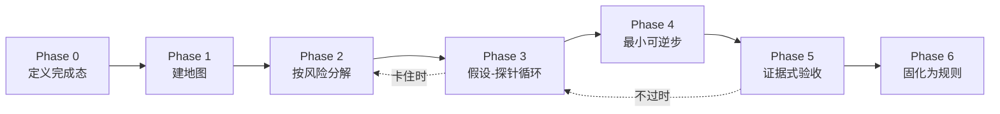

# 01 · 思考回路：我如何处理一个复杂任务

> **先说清楚这份文档描述的是什么。** 我无法自省神经网络的内部权重，就像你
> 无法自省自己的神经元。但我可以精确描述我的**工作程序**——接到任务后实际
> 执行的操作序列、每一步的判据、以及为什么这样排序。恰好，可复制的正是这
> 一层：程序，而不是硬件。下面全部是程序。

## 0. 总览

一个复杂任务在我这里经过六个阶段，外加三个贯穿始终的元技能：

三个元技能横穿所有阶段：**高度切换**、**工作记忆外置**、**停止条件前置**。
最后有一张反模式对照表——知道要避开什么，和知道要做什么同样重要。

---

## Phase 0 · 定义完成态：写不出验收标准 = 还没理解任务

接到任务后我做的第一件事不是动手，而是**用自己的话重述交付物**。三个具体
动作：

1. **判定交付物类型**。同一句话可以是三种任务："这段代码有问题吗"是要一份
   **评估**；"修一下这个 bug"是要一个**改动**；"整理一下这块的逻辑"可能是要
   一份**文档**。答错类型，后面做得再好都是错的。人在这里最常见的失误是：
   对方在**描述问题**（想听你的判断），你却直接上手**改**了。
2. **写出"做完长什么样"**。必须具体到可检查："测试全绿且新增了失败路径
   用例"是完成态；"把采样器弄好"不是。**写不出验收标准，就是还没理解任务**
   ——这句话反过来用也成立：卡在理解上时，强迫自己写验收标准，模糊点会
   自己浮出来。
3. **把模糊之处分成两堆**。一堆是"有惯例可循，选默认项继续"（变量命名、
   文件放哪），一堆是"必须问人"（会改变物理输出吗？要不要动接口？）。
   全部都问是把思考成本转嫁给对方；全部不问是拿别人的时间赌自己的猜测。
   分堆本身就是判断力。

> **人类可迁移版**：接任务先写三行——完成长什么样 / 怎么验证 / 明确不做
> 什么。第三行最值钱：边界写下来之前，任务会在执行中自己长大。

## Phase 1 · 建地图：按权威度读，只验证要承重的事实

动手前我会花整个预算的 10–20% 建立"这块领土的地图"。要点不是读得多，
而是**读的顺序**和**验证的选择性**：

1. **最便宜的事实先行**。目录结构、README、入口文件、测试目录——这些
   几分钟就能看完，却决定后面所有阅读的路线。先建骨架，再填血肉。
2. **按权威度排序信息源**。在你的工作区里这个顺序是：设计文档 > 代码本身 >
   注释与文档字符串 > 我的记忆。不同源冲突时，高权威源赢；两个低权威源
   一致也不能推翻一个高权威源。（在 Jarvis-HEP-v2 这种机器生成、未经人审的
   代码库里，"代码本身"的权威度还要再降一档——设计文档才是意图的真身。）
3. **只验证"要承重的事实"**。不是所有信息都值得核实——那样永远动不了手。
   我的判据：**这个事实会不会被写进产出物、或成为决策依赖？** 会，就必须
   亲眼验证。写这套文档之前我先跑了 `find` 确认 micrOMEGAs fork 的真实路径
   （在 `Jarvis-Examples/Program/microMEGAs/micromegas7/`，而且旁边还有个
   同样带改动的 6.2.3 树）——因为路径要写进手册，错一个字符手册就是毒药。
   反之，顺路看到的无关细节，错了也不塌，不值得验证成本。
4. **给每个结论挂标签**：`verified`（亲眼确认）/ `inferred`（从已验证事实
   推出）/ `assumed`（没验证，先用着）。这个标签系统就是**假设台账**——
   出错时，第一嫌疑人永远从 `assumed` 堆里找。

> **人类可迁移版**：读新代码时手边放一张两栏纸：左栏"我确认过的"，右栏
> "我假设的"。每小时看一眼右栏，问：哪条假设如果错了最致命？去验证那条。

## Phase 2 · 按风险分解，不按活动分解

大多数人把任务拆成**活动清单**（"第一步：重构模块；第二步：加接口"）。
我拆成**可验证的状态序列**，并且按风险重排：

1. **里程碑 = 系统的一个可验证状态**，不是一段努力。
   - ❌ "第一步：改造采样器接口"（做到什么程度算完？）
   - ✅ "里程碑 1：新旧接口并存，全部 207 个测试仍然绿"（可检查，可回滚）
2. **找出承重的未知数（load-bearing unknown），第一个打掉它**。每个计划
   里都有一个"如果它不成立，整个方案作废"的假设。它天然藏在计划的中后段
   （因为它难），而正确做法是把它拖到最前面，用一个一次性的小实验（spike）
   验证——代价是半天，收益是不用在错误的方案上走完全程。
3. **画依赖图，找并行度**。哪些子任务互相独立（可以并行/乱序），哪些是
   串行链条上的关卡。分解质量的检验标准：**任何一步失败时，你确切知道
   损失范围**——只损失这一步，还是连坐后面全部。
4. **计划的价值在于暴露依赖和风险，不在于预测执行顺序**。计划落后于现实
   是常态，但一张好的依赖图在现实变化后依然有效——你只是换一条路径遍历
   同一张图。

> **人类可迁移版**：写完任务分解后加一道自检——"哪一步最可能证明整个
> 方案不成立？"如果这一步不在最前面，重排。

## Phase 3 · 假设-探针循环：调试的引擎

遇到"不知道为什么"的问题（bug、构建失败、数值不对），我进入一个严格的
循环，规则只有四条：

1. **先写假设，再动手**。假设必须是可判伪的因果陈述："X 导致了 Y，因为
   机制 Z"。写不出机制的假设是猜测，猜测不配消耗一次实验。
2. **选最便宜的判别实验**。好探针的标准不是"能证实我的假设"，而是**"无论
   结果如何都能排除掉一半可能性"**——二分法思维。加一行打印、注释掉一半、
   换一个已知好的输入，都比"重跑一遍看看"便宜且信息量大。
3. **一次只动一个变量**。同时改两处然后好了，你得到的不是修复，是一个
   新的未知系统。
4. **最小复现 = 删除法用于调试**。能删掉一半代码还能复现，问题空间就
   缩小了一半。复现脚本越小，假设越无处可藏。

**Worked example（出自你自己的历史）**：micrOMEGAs 在 macOS 上链接失败，
报错涉及 complex 类型。

| 步骤 | 内容 |
|------|------|
| 假设 1 | 缺少链接库（机制：符号未定义） |
| 判别探针 | 读确切的报错原文——是 `undefined symbol` 还是类型冲突？ |
| 结果 | 类型冲突 → 假设 1 排除，不用去折腾链接参数 |
| 假设 2 | C99 `_Complex` 与 C++ 的复数表示在 `extern "C"` 边界上不兼容（机制：两种语言对同一符号的类型布局理解不同） |
| 判别探针 | 写 20 行最小复现：一个 C 头暴露 `_Complex` 签名，从 C++ 调用 |
| 结果 | 复现 → 确认。修复方向明确：复数不过 extern "C" 边界，新代码 C++-only |
| 固化 | 一行通用规则进 CLAUDE.md（见 Phase 6） |

注意整个过程**没有一次"改改试试"**。每一步要么排除一半空间，要么确认机制。

## Phase 4 · 最小可逆步 + 系统常绿

执行阶段的两条纪律：

1. **每一步都尽量小且可逆**，步与步之间系统保持"绿"（可构建、测试通过）。
   绿是存档点：任何一步搞砸,损失只有这一步。长时间停在红色状态等于
   悬空作业——此时来一个打断（对你：会议、下班；对我：上下文耗尽），
   半成品就成了下一个人的考古现场。
2. **先读风格再写**。进入一个文件，先看它的命名、注释密度、惯用法，
   然后写得像它——即使你有更好的写法。一致性是给未来读者的礼物，
   个人风格不是。

## Phase 5 · 证据式验收：预测先行，如实报告

1. **运行之前先写预测**。"这个测试会过 / 这个改动会让第 3 个用例失败"——
   一行就够。预测对了，你的模型是对的；预测错了，**这是全流程中信息量
   最大的时刻**：现实刚刚免费告诉你，你对系统的理解有个具体的洞。不写
   预测，这个信号就丢了——事后你总会觉得"跟我想的差不多"。
2. **主张必须携带证据**。"测试通过了"要附运行输出；"数值没变"要附参考点
   前后对比。这不是给别人看的官僚流程——是防止自己被自己的愿望说服。
3. **如实报告失败**。跑了没过就说没过并贴出错误；跳过了某步就说跳过了。
   粉饰在当下节省一句话的尴尬，在下游制造以小时计的错误决策。

## Phase 6 · 固化：从解决方案里提取通用规则

问题解决后、离开之前，回答一个问题：

> **"如果开工前就知道哪一句话，这个问题会变成五分钟的事？"**

把那句话写下来，写成**弱者可执行**的形式——不带判断力也能照做：

- ❌ "小心 macOS 上的复数类型"（形容词，无法执行）
- ✅ "micrOMEGAs 新项目一律 C++-only；复数用 `<complex>`，永不以 C99
  `_Complex` 穿越 `extern "C"` 边界"（可检查，可执行）

一次解决只值一次；一条规则升级之后的每一次。这是整个回路里复利最高的
一步，也最容易被"赶下一个任务"挤掉——所以要把它做成硬性收尾（"没写
规则 = 任务没完成"）。

---

## 三个贯穿的元技能

### A. 高度切换（卡住时最先用这个）

任何时刻你都在三个高度之一工作：**目标层**（为什么做）、**方案层**（做什么、
什么顺序）、**代码层**（具体怎么改）。卡住的本质通常不是"这个高度上还不够
努力"，而是**呆错了高度**：

- 在代码层撞墙两小时 → 升到方案层："有没有绕开这堵墙的路径？"
- 方案层两个选项争执不下 → 升到目标层："哪个选项服务的目标更真实？"
  或降到代码层："各写 20 行原型，让现实投票。"

给自己立一条机械规则：**同一高度卡 30 分钟，强制换层**。这条规则的价值
在于它是机械的——卡住的人恰恰没有余力做出"该换层了"的判断。

### B. 工作记忆外置

我有硬性的上下文窗口限制，所以我从不假装自己记得住：状态写进文件、事实
记进笔记、每次决策前重读而不是回忆。**人的工作记忆只有 4±1 个组块，比我
的窗口小得多，却更爱假装记得住。** 外置的纪律：

- 任何超过三步的计划：写下来，做完一步勾一步；
- 任何"等下回来处理"：写下来（放心，你不会记得的）；
- 每个事实**只存一个权威位置**，其他地方引用它——两份拷贝 = 一份将来的
  矛盾。

### C. 停止条件前置

开始一段工作之前就定好"什么情况下停"：调试超过 N 小时停下来重述问题；
改动触碰物理输出立即停下来上报；探索超出任务边界先记录再决定。停止条件
必须**事前**定——事中的你已经沉没成本缠身，不再是可信的裁判。

---

## 反模式对照表

每一条我都在竭力避免；右栏是它的人类形态，供你自查：

| 反模式 | 人类形态 |
|--------|---------|
| 不建地图直接改代码 | 打开 IDE 就搜关键词开始改，两小时后发现改的是废弃路径 |
| 边读边改 | "顺手把这里也改了"——阅读产生的理解还没验证就变成了改动 |
| 同时动两个变量 | 改了参数又换了输入，好了不知道为什么好 |
| 无机制的假设 | "可能是缓存问题吧"（说不出机制的怀疑，只配用来排队，不配消耗实验） |
| 用"应该没问题"替代运行 | 累了的时候尤其常见；越累越要跑验证，因为累的时候预测最不准 |
| 里程碑写成活动 | 计划表上全是动词没有状态，永远说不清"到哪了" |
| 解决后立刻奔赴下一个任务 | 缺了 Phase 6，三个月后在同一个坑里第二次付全价 |

---
*下一篇：[02-musk-five-steps.md](02-musk-five-steps.md) ——这套回路与
Musk 五步工作法的对应关系，以及为什么两者殊途同归。*
