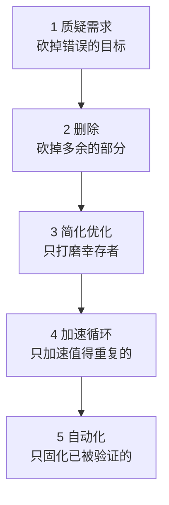

# 02 · Musk 五步工作法：原文、案例、与思考回路的映射

## 1. 出处

2021 年夏天，Elon Musk 在 Starbase 接受 Tim Dodd（Everyday Astronaut）的
工厂参观访谈时，完整口述了这套他在 SpaceX 和 Tesla 强制推行的工程方法，
后来 Walter Isaacson 的传记（2023）把它称为 **"The Algorithm"**。它的全部
内容是五个步骤和一条铁律：**顺序不可换**。

背景值得一提：这套方法是 Musk 在 Tesla Model 3 产能地狱（2017–2018）里
**把每一步都做反了**之后总结的——他原话承认："我本人多次在所有五步上
倒着走。"所以它不是天才的先验洞见，是昂贵学费换来的事后清单。

## 2. 五步逐条

### 第 1 步 · 让需求少一点蠢（Make your requirements less dumb）

> "你的需求肯定是蠢的，无论谁给你的。**聪明人给的需求尤其危险——因为你
> 不会去质疑它。**"

配套规则：**每条需求必须挂一个人名**，不能挂部门（"安全团队要求的"）。
部门不会回答"为什么"，人会。找到那个人，问这条需求想达成什么，多数时候
会发现：目的正当，但这条需求是达成目的的糟糕方式，或者目的已经消失了。

### 第 2 步 · 删除零件或流程(Delete the part or process)

> "如果你没有偶尔把删掉的东西加回来，说明你删得不够。"

量化判据：**加回率约 10%** 才说明删除足够激进。所有人的偏置都是"以防
万一先加上"——因为加东西的责任由系统扩散，删东西的责任归个人。这条
是五步里最反人性的，也是收益最大的：**最好的零件是不存在的零件**——
不存在的零件不会坏、不用测、没有重量、没有成本。

### 第 3 步 · 简化和优化(Simplify or optimize)

> "聪明工程师最常见的错误，是优化一个**根本不该存在**的东西。"

关键在于它排第三而不是第一。学校训练出的本能是"回答给定的问题"——你
不能对教授说这题出错了。于是聪明人拿到什么优化什么，越聪明的人把不该
存在的东西优化得越漂亮，删除它的心理成本也随之越高。前两步的存在就是
为了保证到达这一步的东西**配得上被优化**。

### 第 4 步 · 加速迭代周期(Accelerate cycle time)

> "任何流程都能再快。但前三步没做完之前不许加速——**如果你在挖自己的
> 坟墓，别挖快点。**"

### 第 5 步 · 自动化(Automate)

放在**最后**。Musk 的招牌错案：Model 3 产线上电池包顶部的玻纤隔垫，
机器人抓取失败率居高不下，整条线为它停摆。他的复盘：我们先**自动化**了
这道工序，然后**加速**它，然后**简化**它，最后才有人问——**这垫子是干嘛
的？** 答案：降噪。测试：装与不装，车内麦克风听不出区别。这条需求来自
噪声组，但噪声组以为是防火需求；挂不出一个真正的主人。于是整道工序
被删除——而在此之前，最聪明的一批自动化工程师在优化它。

**一个不该存在的零件，走完了全部五步的反向旅程。这就是顺序不可换的原因。**

## 3. 为什么顺序不可换

每一步为下一步**减少工作对象**：

倒着执行的代价是指数的：自动化一个应删除的流程，意味着你为它写的每一行
脚本、省下的每一分钟、优化掉的每一毫秒，全部是负资产——不仅白做，还
增加了将来删除它的阻力（"我们都自动化了，删了多可惜"——沉没成本开始
替它辩护）。

## 4. 五步 ↔ 思考回路的映射

我的六阶段回路（见 [01-the-loop.md](01-the-loop.md)）和五步法是同一个
思想的两种展开——五步法按**做什么的顺序**组织，回路按**任务的时间线**
组织。对应关系：

| Musk 五步 | 思考回路对应 | 共同的内核 |
|-----------|-------------|-----------|
| 1 质疑需求 | Phase 0 定义完成态：判定交付物类型、重述任务、边界写下来 | 先确认问题是真的，再解决它 |
| 2 删除 | Phase 1 的"只验证承重事实"、Phase 2 的范围收缩、Phase 3 的最小复现 | 缩小战场是最高效的加速 |
| 3 简化优化 | Phase 4 的重构纪律：常绿状态下打磨幸存下来的核心 | 只优化确认要留下的东西 |
| 4 加速循环 | Phase 3 的"最便宜判别实验优先"、Phase 5 的预测-验证小循环 | 单位时间内的信息获取量才是速度 |
| 5 自动化 | Phase 6 固化为规则 + 元技能"停止条件前置" | 把被验证过的判断变成不耗判断力的机制 |

注意一个微妙差别：五步法诞生于**流水线**（同一流程重复百万次），所以
"自动化"指机器；知识工作里同一任务很少精确重复，所以第 5 步的形态变成
**规则、检查清单、技能、习惯**——自动化的对象不是动作，而是**判断**。

## 5. 三个场景的实例化

### 场景 A · 接到一个复杂代码任务

| 步 | 动作 | 你工作区里的例子 |
|---|------|----------------|
| 1 | 问：这个任务服务什么目的？谁提的？如果不做会怎样？ | "给扫描加个画图功能" → 真需求可能是"看 R(s) 修正开关前后的差异"——那也许只需要一个对比脚本，不需要功能 |
| 2 | 砍掉任务里不服务目的的部分；能改配置解决的不写代码 | DeltaDD 只做运动学一侧、截面侧**故意**推迟——这就是删除法的活标本 |
| 3 | 对留下的核心做干净的设计 | 复用 `improveCS.c` 的 override 机制而不是发明新钩子 |
| 4 | 建立最小验证环：一个参考点、一条命令、秒级反馈 | `testIO` 的 JSON 对比就是这个环 |
| 5 | 把过程中确立的判断写进 CLAUDE.md / 手册 / 回归测试 | 本文件夹的 model-guides 全部属于第 5 步 |

### 场景 B · 学习一个复杂程序包

| 步 | 动作 |
|---|------|
| 1 | 质疑"学会"的定义：你要的是能改 bug？能加模块？还是只是会调用 API？三者要读的东西差一个数量级。**"完整理解整个包"几乎永远是蠢需求。** |
| 2 | 明确**不读清单**：vendored 依赖、生成代码、废弃路径、与你目的无关的子系统。删除的对象是你的阅读范围 |
| 3 | 把理解压缩成自己的表述：一页架构图、一条数据流叙述——压缩就是简化，压不动的地方就是没懂的地方 |
| 4 | 第一天就让它跑起来。能运行的包才有反馈环：改一处、预测、观察。读十小时不如跑十次 |
| 5 | 把侦察过程固化成清单（见 [04-learning-codebases.md](04-learning-codebases.md)），下个包直接复用 |

### 场景 C · 自我提升本身

| 步 | 动作 |
|---|------|
| 1 | 质疑训练目标：你缺的到底是"读代码慢"还是"读了记不住"还是"不敢下手"？对症的练习差别极大 |
| 2 | 删掉不产生反馈的学习形式（无笔记的视频、不动手的教程）——没有反馈的练习不是练习 |
| 3 | 把留下的练习打磨成固定动作（drill 化，见 [05-training-program.md](05-training-program.md)） |
| 4 | 缩短反馈周期：预测练习当天出分，比"感觉自己变强了"快一千倍 |
| 5 | 习惯化：drill 融进工作流程，不再消耗意志力——**技能习得研究里这叫
automaticity，正是"自动化"的字面义** |

## 6. 常见误用警示

- **拿第 2 步当借口砍测试和文档**。删除的判据是"不服务目的"，而测试和
  文档服务的是"未来的修改成本"——那是真目的。删它们之前先给它们挂
  需求主人：主人是三个月后的你。
- **拿第 1 步当拖延**。质疑需求是一个**有时限的动作**（问出主人、问出
  目的、得到答案），不是无限期的"我再想想这事该不该做"。
- **跳过加回检验**。定期问：过去一个月我把删掉的东西加回来过吗？一次都
  没有 → 你在删除上仍然太保守。这条对阅读范围同样成立：如果你从没有
  "哎还得回去读那个模块"的时刻，说明你第一遍读得太多了。
- **把第 5 步做成第 1 步**。买工具、搭系统、配 Notion 一整天——在方法
  被手动验证有效之前自动化它，就是给玻纤垫子造机器人。

---
*下一篇：[03-complex-code-tasks.md](03-complex-code-tasks.md) ——把以上
两套东西合成一份"接到复杂代码任务时"的操作手册。*
