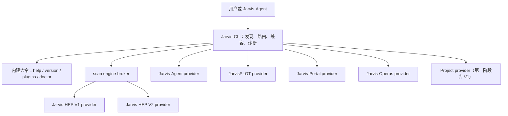

# Jarvis 统一命令行设计

> 状态：设计草案（尚未实现）  
> 基线日期：2026-07-13  
> 适用范围：Jarvis-HEP V1、Jarvis-HEP V2、Jarvis-Agent、JarvisPLOT、Jarvis-Portal、Jarvis-Operas  
> 本轮边界：只形成产品与技术设计，不修改任何组件代码

## 1. 结论

建议新增一个独立、轻量的 `Jarvis-CLI` 分发包，由它**唯一拥有**系统命令
`Jarvis`。各业务组件继续独立发布、独立解析自己的参数，通过 Python entry point
注册到统一入口：

```text
Jarvis scan ...       # HEP 扫描；可显式选择 V1 或 V2
Jarvis agent ...      # Jarvis-Agent
Jarvis plot ...       # JarvisPLOT
Jarvis portal ...     # Jarvis-Portal
Jarvis opera ...      # Jarvis-Operas
Jarvis project ...    # 项目创建、打包与官方项目库
```

统一入口只负责命令发现、路由、兼容、诊断和进程生命周期，不吸收扫描、绘图、
IO、算子或 Agent 的业务代码。各组件现有直连命令继续保留，作为开发、调试和故障
恢复入口。

V2 尚未发布，而且当前不能无修改运行 V1 Eggbox 项目，因此：

- `Jarvis task.yaml ...` 必须继续保持 V1 行为；
- `Jarvis scan task.yaml` 的默认 engine 也必须先是 `v1`；
- 用户可用 `--engine v2` 主动试用 V2；
- 只有 V1 项目兼容门全部通过后，才能讨论在一个明确的大版本中切换默认值；
- 禁止根据 YAML 内容猜测 V1/V2，以免同一项目在升级后静默换执行引擎。

## 2. 当前基线

以下信息来自各仓库当前 `pyproject.toml` 和 CLI 实现，而不是未来设想。

| 组件 | 当前版本 | 当前命令 | 当前主要接口 |
|---|---:|---|---|
| Jarvis-HEP V1 | 1.7.5 | `Jarvis` | `Jarvis FILE`、`project`、`portal formats`、`--plot`、`--convert`、`--monitor`、`--resume`、`--check-modules`、`--benchmark` |
| Jarvis-HEP V2 | 2.0.0.dev0 | `Jarvis2` | task YAML、`--monitor`、`--plot`、`--check-modules`、`--resume`、Redis 参数 |
| Jarvis-Agent | 0.1.0 | `jarvis-agent` | `init`、`tui`、`index`、`explain`、`yaml-review`、`ask`、`models`、session/report/package 工具 |
| JarvisPLOT | 1.4.2 | `jplot` | plot YAML、`flowchart`、`--parse-data`、`--rebuild-cache` 等 |
| Jarvis-Portal | 1.3.0 | `jportal` | `FILE`、`man [format]`；V1 另提供 `Jarvis portal formats` |
| Jarvis-Operas | 1.3.8 | `jopera` | `list`、`info`、`call`、`acall`、`load`、`init`、`interp` |

当前最大的发布风险是：`Jarvis` 已由 `Jarvis-HEP` V1 拥有。不能再让另一个包也
安装同名 console script；否则“最后安装的包获胜”，卸载任意一个包还可能把另一
个包正在使用的入口删除。因此命令所有权迁移必须作为一个协调发布完成。

前序 Eggbox 兼容审查得到的当前事实是：V1 发布项目有 31 个 YAML，而 V2 以原样
完整运行的结果是 0/31。这个数字不表示 V2 架构不可用，但足以否决“现在默认走
V2”或“自动猜 engine”两种方案。

## 3. 产品模型

### 3.1 命名

- `Jarvis`：整个产品族的统一入口；不是 Jarvis-HEP V1 的同义词。
- `scan`：HEP 扫描能力；V1/V2 是 engine，不是两套面向用户的产品名。
- `agent`、`plot`、`portal`、`opera`：组件自治的一级命令。
- `project`：跨扫描生命周期的项目管理命令；第一阶段仍由 V1 实现。
- `operas` 可作为 `opera` 的兼容别名，但帮助和文档统一使用单数 `opera`。

不建议同时安装大写 `Jarvis` 和小写 `jarvis` 两个 console script。macOS 默认的
大小写不敏感文件系统会让两者冲突。本设计继续沿用已发布产品的大写 `Jarvis`。

### 3.2 用户命令树

```text
Jarvis [GLOBAL_OPTIONS] <command> [COMMAND_ARGUMENTS...]

核心工作流
  scan       运行 HEP scan，选择 V1/V2 engine
  agent      启动或调用 Jarvis-Agent
  plot       绘图、flowchart、数据预解析
  portal     运行 IO YAML、查看格式手册和格式注册表
  opera      查询、加载和调用 operator
  project    创建、打包、浏览和获取项目

系统命令
  help       查看统一或组件帮助
  version    查看 CLI 与已安装组件版本
  plugins    查看命令/engine 的提供者与冲突
  doctor     检查安装、entry point、依赖和默认 engine
  completion 生成 shell completion
  legacy     显式进入完整 V1 CLI（兼容/排障入口）
```

推荐示例：

```bash
# 新的规范写法；发布初期默认仍为 V1
Jarvis scan Eggbox/bin/Example_Bridson.yaml

# 明确选择 engine
Jarvis scan --engine v1 Eggbox/bin/Example_Bridson.yaml
Jarvis scan --engine v2 task-v2.yaml

# 已发布的 V1 写法保持有效
Jarvis Eggbox/bin/Example_Bridson.yaml --benchmark 60
Jarvis task.yaml --check-modules
Jarvis --plot scene.yaml

# 组件命令
Jarvis agent tui
Jarvis agent yaml-review task.yaml
Jarvis plot scene.yaml --rebuild-cache
Jarvis plot flowchart flowchart.json --out flowchart.png
Jarvis portal task.yaml
Jarvis portal man json
Jarvis portal formats
Jarvis opera list --namespace stat
Jarvis opera call math.add --arg a=1 --arg b=2
Jarvis project pack . --repro

# 安装诊断
Jarvis version
Jarvis plugins
Jarvis doctor
```

### 3.3 命令映射

| 统一命令 | 第一阶段 provider | 参数策略 | 直连入口保留 |
|---|---|---|---|
| `Jarvis scan --engine v1 ...` | Jarvis-HEP V1 | 删除统一层的 `--engine` 后，其余 token 原序传递 | `Jarvis1`（迁移时新增） |
| `Jarvis scan --engine v2 ...` | Jarvis-HEP V2 | 原序传递给 V2 adapter | `Jarvis2` |
| `Jarvis agent ...` | Jarvis-Agent | 完整透传 | `jarvis-agent` |
| `Jarvis plot ...` | JarvisPLOT | 完整透传 | `jplot` |
| `Jarvis portal ...` | Jarvis-Portal | 完整透传；`formats` 迁移前需兼容 adapter | `jportal` |
| `Jarvis opera ...` | Jarvis-Operas | 完整透传 | `jopera` |
| `Jarvis project ...` | Jarvis-HEP V1 | 完整透传 | `Jarvis1 project ...` |
| `Jarvis legacy ...` | Jarvis-HEP V1 | 逐 token 原样传递 | `Jarvis1` |

`Jarvis agent` 本身不应被统一层偷偷改成 `Jarvis agent tui`。当前 Agent 在没有
子命令时打印帮助，这个语义应继续由 Agent 自己决定。统一入口不替组件重新解释
参数。

## 4. V1 兼容契约

### 4.1 路由优先级

统一入口按以下顺序路由：

1. 解析位于命令前的统一全局选项；
2. 如果首个业务 token 是内建系统命令，运行内建命令；
3. 如果首个业务 token 是已注册一级命令，交给该 provider；
4. 其他所有形式，在兼容期完整回落到 V1 provider；
5. 如果 V1 provider 未安装，才报告未知命令或缺少 V1，并给出安装提示。

因此下列旧调用不会被新 parser 吞掉：

```text
Jarvis task.yaml ...       -> V1
Jarvis ./plot ...          -> V1（显式路径，不是保留字）
Jarvis --plot scene.yaml   -> V1
Jarvis --monitor ...       -> V1
Jarvis -d task.yaml        -> V1
```

`scan`、`agent`、`plot`、`portal`、`opera`、`project` 等会成为顶层保留字。如果
V1 用户确实有一个文件就叫 `plot`，可使用无歧义形式：

```bash
Jarvis legacy -- plot
Jarvis scan --engine v1 -- plot
```

### 4.2 “原样兼容”的含义

V1 adapter 必须做到：

- 保持参数 token、顺序、相对路径和当前工作目录；
- 将显示用 `argv[0]` 保持为 `Jarvis`，避免帮助和错误信息变成内部 host 名；
- 不把 V1 参数复制到统一 parser；
- 继承 stdin/stdout/stderr、TTY、颜色环境和终端尺寸；
- 原样返回 V1 exit code；
- 保持 SIGINT/SIGTERM 行为；
- 不改写 YAML，也不注入 V2 字段。

这比在统一层重新实现一份 V1 `argparse` 更可靠。只要 V1 增加一个选项，统一入口
无需同步发布即可自动透传。

### 4.3 V1/V2 engine 选择

优先级从高到低为：

1. `Jarvis scan --engine v1|v2`
2. 环境变量 `JARVIS_SCAN_ENGINE`
3. 项目配置 `.jarvis/config.toml`
4. 用户配置 `$XDG_CONFIG_HOME/jarvis/config.toml`
5. 产品默认值 `v1`

示例配置：

```toml
[scan]
default_engine = "v1"
```

engine 选择属于执行环境，不应写进 physics task YAML。这样 V1 YAML 公共结构无需
变化，同一份项目也能在命令行上显式做 V1/V2 对照。

严禁采用以下策略：

- 看见某个 YAML key 就自动改走 V2；
- V2 解析失败后静默回退 V1；
- V1 运行失败后静默重跑 V2。

这些行为会造成双重执行、结果目录污染和不可解释的复现差异。engine 一旦选定，
失败就应由该 engine 明确返回。

### 4.4 默认值切换门

从 `v1` 切换为 `v2` 必须同时满足：

- Eggbox 31/31 YAML 无修改通过结构解析；
- 代表性项目完成实际运行，而不只是 dry-run；
- 参数、expression、calculator DAG、sampling 语义达到冻结契约；
- HDF5/CSV、run summary、checkpoint/resume 与约定兼容；
- `--check-modules`、monitor、benchmark 等发布接口有明确等价或迁移说明；
- PLOT、Portal、Operas 的生产路径不是只有 import/烟测级连接；
- 提供 `--engine v1` 的稳定回退和一份发布迁移说明；
- 默认切换经过独立 beta 周期，不能在补丁版本中静默发生。

即使以上门全部通过，已有项目级 `.jarvis/config.toml` 中的显式 `v1` 也不能被
覆盖。

## 5. 架构



### 5.1 包职责

`Jarvis-CLI` 可以包含：

- 顶层参数与 legacy 判定；
- entry point 发现；
- scan engine 选择；
- provider host；
- 版本、插件、doctor、completion；
- 统一 invocation context 和错误格式。

`Jarvis-CLI` 不可以包含：

- HEP YAML schema 或 sampler；
- plotting scene parser；
- Portal adapter 注册表实现；
- Operas function registry；
- Agent 模型/runtime；
- 自动下载安装组件；
- 组件业务输出的复制实现。

### 5.2 插件注册

建议使用两个 entry point group：

```toml
# 普通一级命令
[project.entry-points."jarvis.commands"]
agent = "jarvis_agent.jarvis_plugin:provider"
plot = "jarvisplot.jarvis_plugin:provider"
portal = "jarvis_portal.jarvis_plugin:provider"
opera = "jarvis_operas.jarvis_plugin:provider"
project = "jarvishep.jarvis_plugin:project_provider"

# 同一能力的多个 engine
[project.entry-points."jarvis.scan_engines"]
v1 = "jarvishep.jarvis_plugin:scan_provider"
v2 = "jarvishep2.jarvis_plugin:scan_provider"
```

provider contract v1 至少包含：

```text
api_version       协议主版本，初始为 1
name              command 或 engine 的规范名
summary           一行帮助
aliases           可选别名
distribution      提供者分发包
provider_version  提供者版本
main(argv)        argv 不含顶层 Jarvis 与一级命令
```

规则：

- `help/version/plugins/doctor/completion/legacy/scan` 为 CLI 保留字；
- 普通命令重名或 alias 冲突必须报错，禁止“最后安装者获胜”；
- scan engine 名重名也必须报错；
- entry point 发现阶段不 import 重型组件；
- 只有实际调用 provider 时，才在隔离 host 中加载它；
- `Jarvis doctor` 可在带 timeout 的独立检查进程中加载每个 provider；一个坏插件
  不能导致所有 `Jarvis` 命令无法启动。

### 5.3 进程隔离

默认采用进程级派发，不在顶层进程 import 所有组件。原因包括：

- 各组件依赖树、日志初始化和 event loop 相互独立；
- V1 会临时操作 `sys.argv`，Operas/Agent 也有自己的 CLI/runtime 状态；
- 一个组件的 import 错误不应破坏其他命令；
- 组件退出码、信号和 TTY 行为更容易保持。

POSIX 上优先用 `exec` 将 dispatcher 替换为 provider host，从而保持 PID、TTY、
stdin/stdout/stderr 和信号语义。不能使用 `exec` 的平台再使用 subprocess fallback，
并对 signal/exit code 做一致性测试。任何平台都必须使用 argv 数组，禁止拼接 shell
字符串。

### 5.4 Invocation context

统一入口只通过环境传递少量非业务上下文：

```text
JARVIS_INVOCATION_ID       一条跨组件调用链的 UUID
JARVIS_PARENT_COMMAND      直接上游命令，例如 agent
JARVIS_INVOCATION_DEPTH    嵌套深度
JARVIS_PROJECT_ROOT        已明确解析时的项目根；未知则不设置
JARVIS_SCAN_ENGINE         scan 已选择的 engine
```

Agent 调用 `Jarvis scan` 时继承 invocation ID 并增加 depth。超过安全上限（建议 8）
就拒绝继续嵌套，避免 `agent -> Jarvis agent -> ...` 无限递归。上下文不能包含 token、
API key 或完整环境快照。

## 6. 帮助、输出与错误契约

### 6.1 帮助

- `Jarvis --help`：只显示统一命令、是否可用、provider 名；不 import 重型组件。
- `Jarvis <command> --help`：交给该组件，因此帮助永远与组件版本同步。
- `Jarvis help <command>`：等价于上一条。
- 未安装的已知命令仍可出现在帮助中，但标记为 unavailable 并给出包名。
- 第三方命令只在其 entry point 已安装后出现。

### 6.2 输出边界

- provider 拥有 stdout；统一入口不加 logo、不包表格、不改颜色；
- dispatcher 自己的诊断写 stderr；
- 子命令 exit code 原样返回；
- `Jarvis version/plugins/doctor --json` 可提供稳定 JSON；
- 对 provider 的 `--json` 只透传，不在统一层再套一层 JSON；
- Agent 若需要稳定机器接口，应优先使用组件正式 JSON/API 契约，而不是解析人类帮助。

### 6.3 退出码

| 场景 | 退出码 |
|---|---:|
| 成功 | 0 |
| 统一层参数错误 | 2 |
| provider 已注册但无法启动 | 126 |
| provider/engine 未安装 | 127 |
| SIGINT | 130 |
| SIGTERM | 143 |
| provider 自身失败 | 原样返回 provider exit code |

插件冲突属于安装损坏：`Jarvis doctor` 必须明确列出冲突分发包，实际调用冲突命令
时拒绝任意选择。

## 7. 安全与可维护性

- 所有派发使用 argv 数组，绝不启用 `shell=True`；
- 默认只信任当前 Python 环境中已安装分发包的 entry point；
- 不自动执行项目目录里同名脚本，不从当前目录发现“插件”；
- `Jarvis plugins` 显示 distribution、version、entry point 和 alias 来源；
- `doctor --json` 对路径、环境和配置做必要脱敏，不输出 secrets；
- provider API 采用主版本兼容检查；未知主版本拒绝加载并给修复建议；
- completion 缓存以已安装 distribution 指纹失效，不能在每次 shell 补全时 import
  Agent/HEP runtime；
- CLI core 不依赖任何业务组件，避免依赖环和统一环境膨胀。

## 8. 安装与命令所有权迁移

### 8.1 最终依赖方向

```text
Jarvis-HEP V1 ─────┐
Jarvis-HEP V2 ─────┤
Jarvis-Agent ──────┤
JarvisPLOT ────────┼──> Jarvis-CLI（轻量、无业务依赖）
Jarvis-Portal ─────┤
Jarvis-Operas ─────┘
```

组件可依赖兼容范围内的 `Jarvis-CLI` 并注册 provider；`Jarvis-CLI` 不能反向硬依赖
这些组件。这样安装任意组件都能获得统一入口，安装多个组件也不会形成依赖环。

### 8.2 协调发布顺序

1. 建立 `Jarvis-CLI` 包和 provider API，但集成预览阶段先用临时入口（例如
   `jarvisctl`），不要与 V1 抢占 `Jarvis`。
2. 为 V1 增加 `Jarvis1` 直连入口和 V1 scan/project provider；建立 legacy argv
   golden tests。
3. 为 V2、Agent、PLOT、Portal、Operas 增加各自 provider；保留 `Jarvis2`、
   `jarvis-agent`、`jplot`、`jportal`、`jopera`。
4. 发布一个协调的 V1 版本：依赖 `Jarvis-CLI`、移除自身的 `Jarvis` console
   script，只保留 `Jarvis1`；同一发布中由 `Jarvis-CLI` 正式接管 `Jarvis`。
5. 验证全新安装、原地升级、卸载/重装单组件和多组件环境。
6. 统一入口稳定后，再考虑发布可选的 ecosystem meta-package；这不是第一阶段前置
   条件。

第 4 步必须是原子化的发布决策。不能先把另一个 PyPI 包的 `Jarvis` 脚本发布给
普通用户，再等待 V1 未来某天移除冲突。

### 8.3 `portal formats` 的特殊迁移

当前 `Jarvis portal formats` 实现在 V1，而 `jportal` 只支持 YAML 和 `man`。在
Portal 接管 `Jarvis portal` 之前，应先由 Portal 增加正式 `formats` 子命令，并用
golden test 保持 V1 已发布的格式表语义。迁移前继续由 V1 提供该路径；不要在
`Jarvis-CLI` 中永久复制 Portal registry 查询逻辑。

## 9. 分阶段实施计划

### U0：冻结契约

- 审批本设计中的命令树、保留字和默认 `v1` 决策；
- 捕获 V1 CLI argv/help/exit code golden；
- 固定 provider API v1；
- 明确各仓库 owner 和协调发布窗口。

### U1：CLI core 预览

- 建立无业务依赖的 `Jarvis-CLI`；
- 实现 discovery、provider host、`version/plugins/doctor`；
- 用临时入口验证，不占用生产 `Jarvis`；
- 完成冲突、缺包、坏插件、TTY、signal 测试。

### U2：V1/V2 scan broker

- V1 增加 `Jarvis1`、legacy provider、scan provider、project provider；
- V2 注册 `v2` scan engine，继续保留 `Jarvis2`；
- 实现 `Jarvis scan --engine ...` 和 legacy fallback；
- 默认值固定为 `v1`。

### U3：组件接入

- Agent、PLOT、Portal、Operas 注册一级命令；
- Portal 补齐 `formats` 后再迁移所有权；
- 所有 provider 均为参数透传 adapter，不重写业务 parser；
- 验证多组件依赖矩阵。

### U4：正式接管 `Jarvis`

- 协调发布 V1 与 CLI；
- 完成全新安装和从 V1 1.7.5 升级测试；
- 发布兼容与回滚说明；
- 监测命令冲突和不可用 provider 报告。

### U5：Agent 编排与机器接口

- Agent 通过统一入口调用 scan/plot/portal/opera；
- 使用 invocation context 和 recursion guard；
- 对已有 JSON/API 契约做集成，不解析人类输出；
- 建立一条 Agent 发起 scan、查询状态、调用 plot 的端到端用例。

### U6：评估 V2 默认切换

- 先通过第 4.4 节全部兼容门；
- 经过 beta 和发布公告；
- 只在明确的大版本决策中修改默认值；
- 永久保留显式 `--engine v1|v2`。

## 10. 验收矩阵

### 10.1 路由与兼容

- `Jarvis Eggbox/bin/Example_Bridson.yaml --benchmark 60` 到 V1，argv 顺序不变；
- `Jarvis --plot scene.yaml` 到 V1 legacy 路径；
- `Jarvis scan --engine v1 task.yaml` 到 V1 scan provider；
- `Jarvis scan --engine v2 task.yaml` 到 V2 scan provider；
- 未给 `--engine` 时为 V1；
- 项目配置、环境变量、CLI 的 engine 优先级正确；
- 绝不因 provider 失败而自动改用另一个 engine。

### 10.2 组件

- Agent 的所有现有子命令可透传；
- PLOT 的 YAML、flowchart、`--parse-data` 可透传；
- Portal 的 YAML、manual、formats 可用；
- Operas 的同步/异步 call、user ops、interp 可透传；
- Project 的 create/pack/browse/fetch/info 保持 V1 行为；
- 各直连命令继续工作。

### 10.3 进程与安装

- child exit code、SIGINT、SIGTERM、TTY、颜色和 stdin 行为一致；
- 单组件、多组件、缺组件、坏插件、插件重名环境有确定结果；
- 从 V1 1.7.5 原地升级后 `Jarvis` 仍存在且默认行为不变；
- 卸载 PLOT/Agent 等组件不会删除 `Jarvis`；
- 卸载 V1 后，其他已安装组件仍可由 `Jarvis` 调用；
- `doctor` 不泄漏 secret，并能识别 console script 所有者错误。

### 10.4 Eggbox 发布门

- 31/31 V1 YAML 原样可继续通过 legacy 路由运行；
- V2 兼容进度单独计数和报告，不影响默认 V1；
- V1/V2 对照使用同一 YAML 时，engine 必须在 invocation record 中可追踪；
- 默认 engine 的任何改动都有 golden、迁移说明和回滚验证。

## 11. 明确不做的事情

- 不把六个仓库合并成一个 Python monolith；
- 不在统一入口复制六套 argparse；
- 不为了统一命令而修改 V1 YAML 公共结构；
- 不自动把 V1 YAML 转成 V2 YAML；
- 不用 YAML sniffing、失败重试或启发式规则选择 engine；
- 不让多个 distribution 同时拥有 `Jarvis` console script；
- 不把 CLI 人类输出当成 Agent 的长期机器协议；
- 不在命令派发时自动 `pip install` 缺少的组件。

## 12. 需要确认的产品决策

实现前只剩以下产品级选择需要 owner 确认：

1. 独立分发包是否正式命名为 `Jarvis-CLI`；
2. `opera` 是否接受为规范名，并保留 `operas` alias；
3. `legacy` 是否作为长期公开命令，还是只保留到 V2 默认切换后的一个大版本；
4. 是否要求安装任意一个组件都自动依赖 `Jarvis-CLI`；本设计建议“是”；
5. V1 接管协调版本号与发布时间窗。

这些选择不会改变核心架构：`Jarvis` 只有一个 owner、组件通过插件注册、参数默认
透传、V1 是兼容期 scan 默认 engine。

## 13. 相关设计文档

- [V2 用户接口与集成审查](<Jarvis-HEP V2/USER_INTERFACE_INTEGRATION_REVIEW_2026-07-13.md>)
- [V2 CLI 组件设计](<Jarvis-HEP V2/components/cli.md>)
- [V2 Agent Bridge](<Jarvis-HEP V2/DESIGN_AGENT_BRIDGE_2.0.md>)
- [V2 PLOT Bridge](<Jarvis-HEP V2/DESIGN_PLOT_BRIDGE_2.0.md>)
- [V2 Portal IO](<Jarvis-HEP V2/DESIGN_PORTAL_IO_2.0.md>)
- [V2 Operas Bridge](<Jarvis-HEP V2/DESIGN_OPERAS_BRIDGE_2.0.md>)

