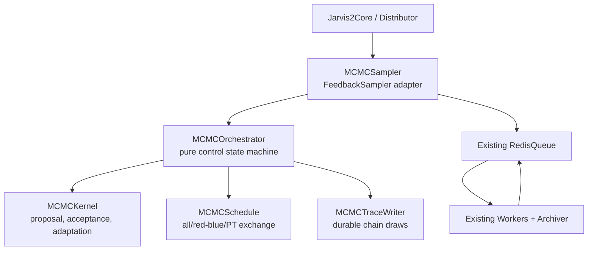
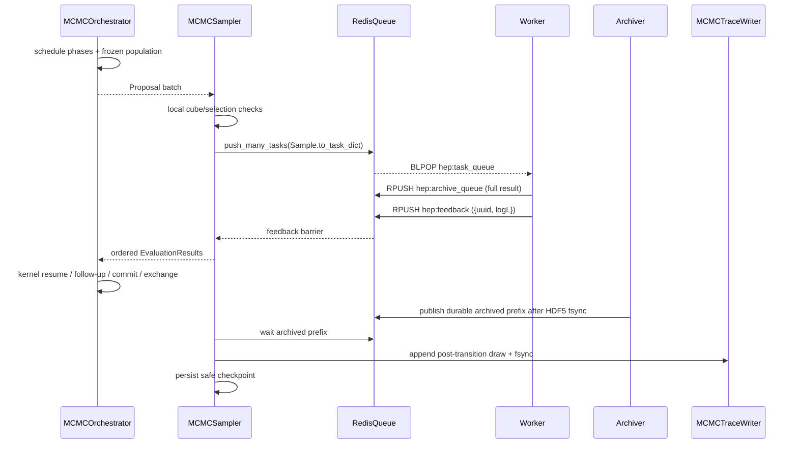

# DESIGN — MCMC Technical Architecture for Jarvis-HEP V2

**Status**: implementation baseline; target architecture with an as-built class split
**Revision**: 2.1
**Date**: 2026-08-11
**Scope**: YAML and schema contract, code/package architecture, class and member-function
contracts, runtime data, Redis/feedback flow, trace output, checkpoint/resume, diagnostics,
method maturity, migration, and test gates for the complete MCMC family.
**Reviewed code**: frozen V1 branch `jarvis1` at `67c147e`; current V2 `master`, especially
`jarvishep2/Sampling/mcmc_sampler.py`, `Sampling/Source/MCMC/`, `FeedbackSampler`,
`CheckpointedSampler`, `Sample`, `RedisQueue`, Worker feedback projection, Archiver, mapper,
Distributor, JSON Schema, validation, and Jarvis man.
**Related designs**:
[`DESIGN_SAMPLERS_2.0.md`](DESIGN_SAMPLERS_2.0.md),
[`DESIGN_FEEDBACK_RETURN_2.0.md`](DESIGN_FEEDBACK_RETURN_2.0.md),
[`DESIGN_RESUME_2.0.md`](DESIGN_RESUME_2.0.md),
[`DESIGN_SAMPLING_MAPPER_2.0.md`](DESIGN_SAMPLING_MAPPER_2.0.md), and
[`DESIGN_YAML_VALIDATION_2.0.md`](DESIGN_YAML_VALIDATION_2.0.md).

---

## 0. Binding decisions

This revision replaces the wider policy-object design in revision 2.0. The target is a
small architecture that is sufficient for the implemented algorithms and leaves clear
extension points without pre-creating unused abstractions.

1. **Keep one Sampling integration spine in V2.** The shared implementation is
   `Sampling/mcmc_sampler.py:MCMCBaseSampler`; each concrete method is a separate module
   (`mcmc.py`, `toymcmc.py`, `ammcmc.py`, `am.py`, `dram.py`, `ensemble_mcmc.py`,
   `demcmc.py`, `ptmcmc.py`, and `ptensemble.py`). `mcmc_base.py` is the stable public
   import path for the base class. There is no method-name branch in the common runtime.
2. **Keep all method knobs under `Sampling.Bounds`.** Do not add `Sampling.MCMC`,
   `Sampling.MCMC.Sampling`, or a second configuration dialect.
3. **Use flat lower-snake-case canonical keys.** Existing short and nested forms are
   compatibility aliases only. Alias conflicts are errors.
4. **Keep the first implementation to six runtime entities:** `MCMCBaseSampler`/
   concrete `MCMCSampler`,
   `MCMCOrchestrator`, `MCMCKernel`, `MCMCSchedule`, `MCMCMethodSpec`, and
   `MCMCTraceWriter`. Add no policy class merely to wrap one function.
5. **Kernel owns its acceptance and adaptation mathematics.** Boundary and selection
   checks are pure support functions. PT exchange is part of the schedule. This avoids
   an object graph with no independent lifecycle.
6. **Redis remains transport, not MCMC state storage.** Reuse the existing task,
   feedback, archive, and durable-prefix keys. Add no per-chain Redis hash, MCMC stream,
   or trace queue.
7. **Worker proposals and Markov-chain draws are different artifacts.** The existing
   sample archive contains evaluated proposals. `mcmc_trace.h5` contains committed chain
   states, including repeated states after rejection.
8. **The unit-cube support policy is fixed initially:** out-of-domain or failed-selection
   proposals are locally rejected. No redraw and no clipping.
9. **Only scientifically validated methods are registered as stable.** V1 names whose
   code is placeholder or structurally incorrect remain roadmap items, not fake fallbacks.
10. **Separate sampler-state checkpoints from durable archive checkpoints.** A normal
    MCMC sampling checkpoint is taken at a feedback barrier (no feedback pending and
    no kernel transition half-open) and does not wait for the Archiver. The outer
    envelope marks whether archive durability has caught up. Final, interrupt, and
    explicitly durable checkpoints still require the durable draw barrier.

### 0.1 Minimal architecture at a glance



---

## 1. Review of the current framework

### 1.1 Existing V2 integration path to preserve

The as-built path is sound:

```text
Jarvis2Core.run()
  -> Distributor.set_method(Sampling.Method)
  -> sampler.set_config(config)
  -> sampler.set_execution_plan_template(...)
  -> bootstrap Redis, Workers, Archiver, and checkpoint callback
  -> Core.run_adaptive_scan()
  -> sampler.run_adaptive()
```

The existing class spine remains authoritative:

```text
SamplingVirtial
  -> CheckpointedSampler
      -> FeedbackSampler
          -> MCMCSampler
```

`SamplingVirtial` is misspelled in the existing public code. This design does not rename
it as part of the MCMC work; a repository-wide rename is a separate compatibility task.

| Existing component | Keep its current responsibility |
|---|---|
| `SamplingVirtial` | Common config, `Sample` creation, execution plan, Redis submission |
| `CheckpointedSampler` | Safe-state selection, checkpoint callback, resume facts |
| `FeedbackSampler` | Pending UUID barrier, feedback drain, seed root, failure policy |
| `Sample` | Small task-wire unit: UUID, sample index, unit coordinates, execution plan |
| `RedisQueue` | Cross-process transport and live counters |
| Worker | Unit-cube mapping, calculators/operas/likelihood, archive + feedback publication |
| Archiver | Durable proposal records and archive acknowledgements |
| Distributor/Core | Method selection and stateful runtime lifecycle |

### 1.2 What current `MCMCBaseSampler` proves

The current approximately 1,100-line sampler is a useful migration proof. It already
demonstrates:

- multiple chains evaluated through Redis Workers;
- deterministic per-generation random streams;
- UUID feedback barriers independent of Worker completion order;
- DRAM follow-up mini-batches;
- red/blue-style ensemble barriers;
- control-side PT exchange;
- V2 checkpoint hooks and diagnostic exports.

These behaviors should be preserved through tests, not preserved as one monolithic class.

### 1.3 Open–closed method boundary (as-built)

The common class owns transport and chain-independent runtime behavior. Concrete sampler
modules own method configuration and engine construction:

```text
MCMCBaseSampler
├── MCMCSampler                 (mcmc.py)
├── ToyMCMCSampler              (toymcmc.py)
├── AdaptiveMCMCBase
│   ├── AMMCMCSampler           (ammcmc.py) → AMSampler (am.py)
│   └── DRAMSampler             (dram.py)
├── EnsembleMCMCBase            (ensemble_mcmc.py)
│   ├── EnsembleMCMCSampler / EnsembleSampler
│   └── PTEnsembleSampler        (ptensemble.py)
├── DEMCMCSampler               (demcmc.py)
└── PTMCMCBase
    ├── PTMCMCSampler           (ptmcmc.py)
    └── PTSampler
```

`Distributor` imports each concrete factory directly. `Sampling.mcmc_sampler` keeps
legacy factory names as a compatibility facade, but no longer constructs every method
through one mutable `method` switch. MCMC checkpoints use a versioned native pickle
for chain engines/history/RNG state, while the outer envelope remains explicit and
revalidates the run specification. Runtime handles and population callbacks are never
pickled; they are rebound after restore.

### 1.3 Current technical and scientific debt

The review found the following issues that the target architecture must not freeze:

- method selection, config parsing, orchestration, scientific kernels, diagnostics, and
  checkpoint serialization are interleaved in one class;
- mutable truth is split between `ChainRuntime` and `engine: Any`, and outer code reaches
  into private engine fields;
- `np.clip` and repeated redraw at unit-cube/selection boundaries change the proposal law
  without the corresponding Hastings correction;
- the current initialization path can accept an invalid first evaluation indirectly;
- accepted-only history is not a Markov-chain trace and gives invalid ESS/R-hat inputs;
- full histories are held in memory and exported only at the end;
- current control-side annotations placed into `sample.observables` do not cross
  `Sample.to_task_dict()`, so they are not a reliable proposal-archive contract;
- `_submitted_uuids` and archive UUID acknowledgement sets grow with the run;
- current PTEnsemble effectively uses one walker per temperature and may select ensemble
  partners targeting different temperatures;
- the V2 MCMC schemas are intentionally `unstable` and do not close `Bounds`, so typos can
  pass `Jarvis validate`;
- V1 Slice/ESS are not full reference algorithms, MALA/HMC/NUTS are placeholders, DREAM
  needs a formula/wiring rewrite, and DRAM beyond the validated stage depth is incomplete.

### 1.4 V1 concepts worth retaining

V1 correctly identified the need for a chain registry, explicit multi-stage state,
append-only history, controller patches, and engine checkpoint state. V2 retains those
concepts in a smaller form:

- `dict[ReplicaKey, ChainState]` replaces a separate registry class;
- `KernelAction` represents resumable multi-stage work;
- a durable trace replaces in-memory full history;
- an optional controller is deferred until a real second control implementation exists;
- versioned `kernel_state` replaces opaque engine instances.

---

## 2. Goals, principles, and non-goals

### 2.1 Goals

- Preserve V2 Core, Redis, Worker, Archiver, Mapper, and FeedbackReturn integration.
- Make every transition auditable: proposal, target, correction, acceptance, state, RNG.
- Support single-proposal, multi-stage, ensemble, differential-evolution, and tempered
  methods without method-name branches in the sampler adapter.
- Make YAML easy to write and strict enough to catch misspellings before Redis starts.
- Make results deterministic for a fixed card and seed regardless of Worker count/order.
- Keep memory and checkpoint size bounded with the number of iterations.
- Allow incremental migration from current V2 without a flag day.

### 2.2 Principles

1. One owner for each mutable fact.
2. Raw YAML ends at `MCMCConfig`; raw feedback ends at `EvaluationResult`.
3. Algorithm code imports no Redis, Core, Worker, Archiver, or `Sample`.
4. A rejected transition is still one committed draw.
5. Population proposals read an immutable phase snapshot.
6. Adaptation and sampling phases are explicit.
7. Checkpoints store small state, not observations already durable on disk.
8. No extension point until an existing algorithm needs it or two implementations exist.

### 2.3 Non-goals of the first architecture release

- no MCMC-specific service or daemon;
- no Redis Streams/PubSub replacement;
- no general probabilistic-programming graph;
- no arbitrary user plug-in loader for kernels;
- no runtime-selectable boundary-policy object;
- no automatic finite-difference gradient farm;
- no RL controller until the ordinary PT implementation is validated;
- no simultaneous rename of `SamplingVirtial` or redesign of all samplers.

---

## 3. Target package and dependency layout

```text
jarvishep2/Sampling/
├── sampler.py                       # existing single Sampling base
├── checkpointed_sampler.py          # existing
├── feedback_sampler.py              # existing, one small barrier refactor
├── mcmc_sampler.py                  # MCMCBaseSampler + legacy factory facade
├── mcmc_base.py                     # public MCMCBaseSampler import path
├── mcmc.py                          # standard MCMCSampler
├── toymcmc.py                       # ToyMCMCSampler
├── adaptive_mcmc.py                 # AM/AMMCMC/DRAM shared base
├── ammcmc.py / am.py / dram.py      # adaptive concrete samplers
├── ensemble_mcmc.py / demcmc.py     # ensemble and DE concrete samplers
├── ptmcmc.py / ptensemble.py        # PT concrete samplers
└── mcmc/
    ├── __init__.py                  # small public exports; no registration side effects
    ├── sampler.py                   # MCMCSampler adapter
    ├── config.py                    # YAML alias resolution + MCMCConfig
    ├── model.py                     # small serializable dataclasses
    ├── registry.py                  # MCMCMethodSpec table + factory lookup
    ├── orchestrator.py              # pure runtime state machine
    ├── schedules.py                 # one configurable MCMCSchedule
    ├── support.py                   # pure unit-cube/support helpers
    ├── diagnostics.py               # pure trace-to-summary functions
    ├── trace.py                     # MCMCTraceWriter / reader
    └── kernels/
        ├── base.py                  # MCMCKernel Protocol
        ├── random_walk.py
        ├── adaptive_metropolis.py
        ├── dram.py
        ├── stretch.py
        └── differential_evolution.py
```

Add new kernel files only when the corresponding method is implemented. Do not create
empty `gradient/`, `policies/`, `runtime/`, `diagnostics/`, or `io/` package trees in M1.

### 3.1 Dependency rule

```text
mcmc/sampler.py
  -> config.py, registry.py, orchestrator.py, trace.py
orchestrator.py
  -> model.py, schedules.py, support.py, kernels/base.py
kernels/*.py
  -> model.py, config.py, numpy
```

Forbidden imports:

- kernels/schedules/orchestrator importing `RedisQueue`, `Sample`, Worker, Archiver, Core;
- `model.py` importing any runtime service;
- Core branching on MCMC method names;
- Distributor constructing concrete kernels;
- kernel code evaluating Mapper or `Sampling.selection` expressions.

### 3.2 Compatibility facade

The stable base import is `jarvishep2.Sampling.mcmc_base`. For older callers,
`jarvishep2/Sampling/mcmc_sampler.py` continues to expose `MCMCSampler` as the base alias
and delegates the legacy factory names to the concrete modules:

```python
from jarvishep2.Sampling.mcmc_base import MCMCBaseSampler
from jarvishep2.Sampling.toymcmc import ToyMCMCSampler
from jarvishep2.Sampling.ammcmc import AMMCMCSampler
```

Delete the facade only after repository and downstream import search is clean.

### 3.3 `Source/MCMC` migration

`Sampling/Source` remains appropriate for vendored third-party code such as Dynesty. The
MCMC engines are Jarvis-owned code and migrate to `Sampling/mcmc/kernels`. Existing source
modules remain compatibility imports until their tests and consumers move. Do not keep
two live scientific implementations after a method migrates.

---

## 4. Minimal entity rule

### 4.1 Runtime entities that are justified

| Entity | Why it has an independent responsibility/lifecycle |
|---|---|
| `MCMCSampler` | Bridges pure MCMC requests to existing V2 `Sample`/Redis/feedback/checkpoint APIs |
| `MCMCOrchestrator` | Owns the serializable transition state machine across batches/stages |
| `MCMCKernel` | Defines method-specific proposal, acceptance, and adaptation mathematics |
| `MCMCSchedule` | Defines which replicas update together and when PT exchange occurs |
| `MCMCMethodSpec` | Immutable method-to-kernel/schedule registration data |
| `MCMCTraceWriter` | Owns a durable file handle, append ordering, fsync, and idempotency |

### 4.2 Deliberately not separate classes in the first release

| Rejected entity | Initial replacement |
|---|---|
| `ChainRegistry` | `dict[ReplicaKey, ChainState]` with sorted-key helper functions |
| `TargetSpace` | existing Worker mapping plus pure support checks in adapter/support module |
| `AcceptanceRule` | kernel-private formula |
| `BoundaryPolicy` | fixed `in_unit_cube()` / local reject behavior |
| `AdaptationPolicy` | AM/DRAM kernel state and functions |
| `ExchangePolicy` | `MCMCSchedule.attempt_exchanges()` |
| `ControlPolicy` | no controller until RL phase |
| `DiagnosticsAccumulator` | counters in state + pure diagnostics over trace |
| `CheckpointCodec` | orchestrator `export_state`/`import_state`, wrapped by existing checkpoint format |
| method-specific config subclasses | one frozen `MCMCConfig` with explicit optional fields |

If a second independently swappable behavior later appears, extraction can occur behind
the existing kernel or schedule contract without changing YAML or Core.

---

## 5. Class and member-function contracts

The signatures below are the implementation contract. Names beginning with `_` remain
package-internal.

### 5.1 `MCMCSampler(FeedbackSampler)`

```python
class MCMCSampler(FeedbackSampler):
    uses_indexed_resume = True

    def __init__(self, method_name: str) -> None: ...
    def set_config(self, config_info: Mapping[str, Any]) -> None: ...
    def feedback_return_spec(self) -> dict[str, Any]: ...
    def propose_generation(self) -> Sequence[Sample] | None: ...
    def absorb_generation(self, results: Sequence[Mapping[str, Any]]) -> None: ...
    def run_adaptive(
        self,
        *,
        generation_timeout: float = 3600.0,
        timeout: float | None = None,
    ) -> int: ...
    def export_runtime_state(self) -> dict[str, Any]: ...
    def import_runtime_state(self, state: Mapping[str, Any]) -> None: ...
    def summary(self) -> dict[str, Any]: ...

    def _proposal_to_sample(
        self, proposal: Proposal, *, sample_index: int
    ) -> Sample: ...
    def _feedback_to_result(
        self, record: Mapping[str, Any]
    ) -> EvaluationResult: ...
    def _selection_accepts(self, position_u: np.ndarray) -> bool: ...
    def _submit_request_batch(
        self, requests: Sequence[Proposal]
    ) -> tuple[int, list[EvaluationResult]]: ...
    def _wait_for_durable_barrier(self, *, timeout: float) -> bool: ...
```

Responsibilities:

- call `super().set_config()` before parsing MCMC config;
- load Variables and Mapper only for selection/support evaluation and Sample construction;
- resolve one `MCMCMethodSpec`, `MCMCKernel`, `MCMCSchedule`, and orchestrator;
- map proposals to existing V2 Samples, assigning deterministic `uuid` and contiguous
  `sample_index` to Worker-evaluated requests;
- locally turn out-of-cube or failed-selection requests into `EvaluationResult(status="invalid")`;
- submit remaining Samples through `_submit_sample_batch()` and drain `hep:feedback`;
- sort feedback by proposal order before passing it to the orchestrator;
- wait for the archive durable prefix, fsync trace, then invoke the existing checkpoint;
- expose minimal feedback `{uuid, logL}`.

It does not implement acceptance formulas, adaptation covariance, DE moves, stretch
moves, DR recursion, or exchange probability.

`propose_generation` and `absorb_generation` remain because `FeedbackSampler` requires
them. They delegate to the orchestrator. `run_adaptive` owns the small outer loop because
multi-stage kernels may require more than one feedback batch for one draw.

### 5.2 `MCMCConfig`

One immutable config class prevents both raw-dict propagation and a hierarchy of nearly
empty method config subclasses.

```python
@dataclass(frozen=True)
class MCMCConfig:
    method_id: str
    num_chains: int
    num_iters: int
    warmup: int
    seed: int
    proposal_scale: tuple[float, ...]
    init_max_attempts: int
    initial_points: (
        tuple[tuple[float, ...], ...]
        | tuple[tuple[tuple[float, ...], ...], ...]
        | None
    )
    on_failure: Literal["reject", "halt"]

    adapt_enabled: bool = False
    adapt_start_iter: int = 100
    adapt_window: int = 25
    adapt_eps: float = 1.0e-6
    adapt_scale: float = 2.38

    dr_steps: int = 2
    dr_scale_factors: tuple[float, ...] = (1.0, 0.5)

    stretch_a: float = 2.0
    de_gamma: float | None = None
    de_noise: float = 1.0e-3
    de_crossover: float = 1.0

    temperature_ladder: tuple[float, ...] = (1.0,)
    exchange_interval: int = 1
    num_temperatures: int | None = None
    walkers_per_temperature: int | None = None

    @classmethod
    def from_sampling(
        cls,
        sampling: Mapping[str, Any],
        *,
        method_spec: MCMCMethodSpec,
        dimension: int,
    ) -> "MCMCConfig": ...

    def replica_keys(self) -> tuple[ReplicaKey, ...]: ...
    def phase_for_draw(self, draw: int) -> Literal["warmup", "sample"]: ...
    def validate_semantics(self, *, dimension: int) -> list[ValidationIssue]: ...
```

Implementation notes:

- internal `proposal_scale` is always a fully normalized tuple;
- irrelevant optional method fields retain defaults but are never read by another kernel;
- config objects contain no logger, expression, Mapper, Redis handle, or callable;
- aliases are resolved before construction and are absent internally;
- `bool("false")` is forbidden; JSON Schema and the parser require a real YAML boolean.

### 5.3 `MCMCMethodSpec` and registry

```python
@dataclass(frozen=True)
class MCMCMethodSpec:
    method_id: str
    aliases: tuple[str, ...]
    kernel_factory: Callable[[MCMCConfig], MCMCKernel]
    update_mode: Literal["all", "red_blue"]
    tempered: bool
    status: Literal["stable", "experimental"]
    min_replicas: int

    def matches(self, name: str) -> bool: ...
```

`registry.py` exposes:

```python
def resolve_method(name: str) -> MCMCMethodSpec: ...
def registered_methods(*, include_experimental: bool = False) -> tuple[str, ...]: ...
def create_sampler(name: str) -> MCMCSampler: ...
```

The registry is a module-level immutable tuple/dict. No singleton registry class is
needed. Canonical IDs are `MCMC`, `AM`, `DRAM`, `EnsembleMCMC`, `DEMCMC`, and `PTMCMC`.
Aliases map as follows:

| User name | Canonical ID |
|---|---|
| `AMMCMC` | `AM` |
| `Ensemble` | `EnsembleMCMC` |
| `PT` | `PTMCMC` |

Checkpoint identifiers and deterministic IDs use the canonical ID. Compatibility factory
functions preserve the user-visible names expected by Distributor.

### 5.4 `MCMCKernel` Protocol

```python
class MCMCKernel(Protocol):
    kernel_id: str
    state_version: int

    def start(
        self,
        chain: ChainState,
        *,
        population: Mapping[ReplicaKey, ChainState],
        config: MCMCConfig,
    ) -> KernelAction: ...

    def resume(
        self,
        chain: ChainState,
        *,
        pending_state: Mapping[str, Any],
        results: tuple[EvaluationResult, ...],
        population: Mapping[ReplicaKey, ChainState],
        config: MCMCConfig,
    ) -> KernelAction: ...
```

Contract:

- a kernel object is stateless and may be shared across replicas;
- all mutable per-replica data lives in `ChainState.kernel_state` and RNG state;
- before schedule commit, a kernel may advance only RNG/kernel pending state; it must not
  replace the committed position, log likelihood, draw, or acceptance counters;
- `start`/`resume` never perform I/O;
- population arrays are copied snapshots fixed for the current update phase;
- a call returns exactly one tagged `KernelAction`;
- every `complete` transition increments one chain draw, accepted or rejected;
- `failed` is reserved for an internal invariant violation, not an ordinary rejected point;
- state payloads include their own version and migrate explicitly or fail clearly.

`KernelAction` supports one or multiple evaluations. This is required for DRAM, Slice,
ESS, finite-difference gradients, HMC, and NUTS; the old `next()/update()` pair cannot
represent these algorithms safely across a crash.

#### 5.4.1 Initial concrete kernels

Concrete classes implement only the common Protocol; they do not form a sampler
inheritance tree.

| Class | Required methods/helpers | Persistent `kernel_state` |
|---|---|---|
| `RandomWalkKernel` | `start`, `resume`, `_draw_step`, `_log_alpha` | none beyond version |
| `AdaptiveMetropolisKernel` | random-walk methods + `_update_moments`, `_adapt_covariance` | count, mean, M2/covariance, last-adapt draw |
| `DRAMKernel` | AM methods + `_stage_one`, `_stage_two`, `_stage_two_log_alpha` | AM state + rejected stage-1 point/logL/alpha |
| `StretchMoveKernel` | `start`, `resume`, `_choose_partner`, `_draw_stretch` | move counters only |
| `DifferentialEvolutionKernel` | `start`, `resume`, `_choose_distinct_pair`, `_draw_mask` | move counters only |

All helpers are deterministic functions of explicit state and the replica RNG. AM uses an
online moment update; it does not retain the full position history. DRAM stage state is
cleared on `complete` and can never appear in a safe-barrier checkpoint.
The AM moment update consumes the committed current position on every warmup draw,
including repeated positions after rejection; it is not an accepted-only covariance.

### 5.5 `MCMCSchedule`

One concrete schedule handles the combinations required by the initial stable methods.

```python
class MCMCSchedule:
    def __init__(
        self,
        *,
        update_mode: Literal["all", "red_blue"],
        tempered: bool,
    ) -> None: ...

    def phases(
        self, state: MCMCRunState
    ) -> tuple[tuple[ReplicaKey, ...], ...]: ...

    def snapshot(
        self,
        state: MCMCRunState,
    ) -> Mapping[ReplicaKey, ChainState]: ...

    def commit(
        self,
        state: MCMCRunState,
        transitions: Sequence[Transition],
    ) -> None: ...

    def should_exchange(self, state: MCMCRunState, config: MCMCConfig) -> bool: ...

    def attempt_exchanges(
        self,
        state: MCMCRunState,
        config: MCMCConfig,
    ) -> tuple[ExchangeEvent, ...]: ...
```

`update_mode="all"` creates one phase containing all independent replicas.
`red_blue` creates two phases per temperature; each phase sees a frozen complement.
The first phase is committed before the second snapshot is made, matching standard
red/blue ensemble updates. PT exchanges run only after every phase for a draw completes.

The schedule owns no Redis or file handle. Its mutable parity/counter/RNG data is stored
in `MCMCRunState.schedule_state`.

### 5.6 `MCMCOrchestrator`

```python
class MCMCOrchestrator:
    def __init__(
        self,
        config: MCMCConfig,
        method_spec: MCMCMethodSpec,
        kernel: MCMCKernel,
        schedule: MCMCSchedule,
    ) -> None: ...

    def next_requests(self) -> tuple[Proposal, ...] | None: ...
    @property
    def next_evaluation_index(self) -> int: ...
    def absorb(
        self, results: Sequence[EvaluationResult]
    ) -> tuple[Transition, ...]: ...
    def at_draw_barrier(self) -> bool: ...
    def is_finished(self) -> bool: ...
    def current_draw_rows(self) -> Sequence[Mapping[str, Any]]: ...
    def export_state(self) -> dict[str, Any]: ...
    def import_state(self, payload: Mapping[str, Any]) -> None: ...
    def summary_counters(self) -> dict[str, Any]: ...

    def _begin_initialization(self) -> tuple[Proposal, ...]: ...
    def _begin_phase(self) -> tuple[Proposal, ...]: ...
    def _resume_actions(
        self, results: Mapping[str, EvaluationResult]
    ) -> tuple[Proposal, ...]: ...
    def _commit_draw(self) -> tuple[Transition, ...]: ...
```

The orchestrator state machine has these states:

```text
NEW -> INITIALIZING -> DRAW_PHASE -> FOLLOW_UP -> COMMIT -> EXCHANGE
                                                  |          |
                                                  +-> BARRIER+
BARRIER -> DRAW_PHASE or FINISHED
```

It owns:

- the current `MCMCRunState`;
- ephemeral proposal-to-action metadata for the in-progress draw;
- deterministic request ordering;
- initialization retries;
- kernel invocation and schedule commit;
- counters needed to construct trace rows.

Ephemeral pending actions are deliberately not checkpointed. A safe checkpoint exists
only at `BARRIER`; a crash mid-draw restores the previous barrier and deterministically
recreates the same proposals and IDs.

### 5.7 `MCMCTraceWriter`

```python
class MCMCTraceWriter:
    def __init__(self, path: str, *, dimension: int, metadata: Mapping[str, Any]) -> None: ...
    def open(self, *, resume: bool) -> None: ...
    def append_draw(
        self,
        rows: Sequence[Mapping[str, Any]],
        exchanges: Sequence[ExchangeEvent] = (),
    ) -> int: ...
    def flush(self, *, fsync: bool = True) -> int: ...
    def durable_offset(self) -> int: ...
    def truncate_to_safe_offset(self, offset: int) -> None: ...
    def close(self) -> None: ...
```

This class exists because it owns a file handle and durability lifecycle. It performs
deterministic transition-ID de-duplication at the tail, not a full in-memory ID set.
Normal operation is append-only. `truncate_to_safe_offset` is used only after validating
that a crash left an incomplete HDF5 extent past the checkpointed offset.

### 5.8 Pure module functions

`support.py`:

```python
def in_unit_cube(position_u: np.ndarray) -> bool: ...
def log_target(log_likelihood: float, *, beta: float) -> float: ...
def metropolis_accept(log_alpha: float, rng: np.random.Generator) -> bool: ...
def stable_uuid(namespace: str, *parts: object) -> str: ...
```

`diagnostics.py`:

```python
def summarize_trace(path: str, *, warmup: int) -> dict[str, Any]: ...
def rank_normalized_split_rhat(chains: np.ndarray) -> np.ndarray: ...
def bulk_tail_ess(chains: np.ndarray) -> tuple[np.ndarray, np.ndarray]: ...
def monte_carlo_standard_error(chains: np.ndarray, ess: np.ndarray) -> np.ndarray: ...
```

These remain functions until they require mutable independent state.

The existing `Sampling/runtime_checkpoint.py` gains one generic disk-replay helper rather
than a new reader service:

```python
def load_archived_evaluations(
    task_result_dir: str,
    requests: Mapping[str, int],  # uuid -> expected sample_index
) -> dict[str, Mapping[str, Any]]: ...
```

It returns only DATABASE-durable UUID/logL/sample-index records requested by the resumed
batch. This is needed when proposals reached disk after the previous safe checkpoint.

### 5.9 Small existing-base refactor

`FeedbackSampler.checkpoint_at_barrier()` currently combines archive polling and checkpoint
writing. MCMC needs to fsync its trace between those two operations. Extract one protected
helper without changing behavior for other samplers:

```python
def _await_archived_uuids(
    self,
    uuids: Collection[str],
    *,
    timeout: float = 5.0,
) -> bool: ...
```

For indexed MCMC, add/use the existing prefix mechanism instead:

```python
def _await_archived_prefix(self, prefix: int, *, timeout: float = 5.0) -> bool: ...
```

`MCMCSampler` assigns `sample_index`, sets `uses_indexed_resume=True`, and uses the prefix.
This avoids an O(total evaluations) UUID acknowledgement set for long runs.
After the prefix is acknowledged, it clears `_submitted_uuids`; for indexed samplers that
list means only the current unacknowledged batch, never the lifetime submission history.

---

## 6. Runtime data model

All payloads below are JSON/pickle serializable after ndarray conversion by the existing
checkpoint helper. Dataclasses do not import transport components.

### 6.1 Replica identity

```python
@dataclass(frozen=True, order=True)
class ReplicaKey:
    temperature_id: int
    walker_id: int
```

Mapping:

| Method topology | Keys |
|---|---|
| ordinary independent chains | `(0, chain_id)` |
| ensemble/DE walkers | `(0, walker_id)` |
| PTMCMC | `(temperature_id, 0)` |
| PTEnsemble | `(temperature_id, walker_id)` |

This removes the invalid assumption that a single integer chain ID can represent both
temperature and walker axes.

### 6.2 Chain state

```python
@dataclass
class ChainState:
    key: ReplicaKey
    draw: int
    position_u: np.ndarray
    log_likelihood: float
    log_target: float
    beta: float
    accepted: int
    rejected: int
    proposal_count: int
    rng_state: dict[str, Any]
    kernel_state: dict[str, Any]
```

There is no `engine: Any`. The kernel is strategy; `ChainState` is mutable truth.

The kernel reconstructs a local `numpy.random.Generator` from `rng_state`, consumes all
random choices for one action, and writes the resulting bit-generator state back before
returning. RNG mutation and `kernel_state` mutation therefore advance together.

`draw=0` is the initialized finite state. User-visible transitions are numbered
`1..num_iters`. The initial probe is not a retained draw. After every committed transition,
accepted or rejected, `draw += 1`.

### 6.3 Proposal

```python
@dataclass(frozen=True)
class Proposal:
    proposal_id: str
    uuid: str
    key: ReplicaKey
    draw: int
    phase_index: int
    stage: int
    attempt: int
    position_u: np.ndarray
    log_q_correction: float
    move: str
```

`sample_index` is assigned by the adapter only when a Worker evaluation is needed. A
proposal locally rejected by unit-cube/selection support has no sample archive row.

`proposal_id` is an internal deterministic identity. `uuid` is the corresponding V2
Sample identity when evaluated; retaining it on local rejects keeps transition IDs stable.

### 6.4 Evaluation result

```python
@dataclass(frozen=True)
class EvaluationResult:
    proposal_id: str
    uuid: str
    sample_index: int | None
    status: Literal["ok", "invalid", "failed"]
    log_likelihood: float
    error_code: str | None = None
```

- `ok`: finite Worker log likelihood;
- `invalid`: local support/selection rejection, no Worker required;
- `failed`: missing/non-finite Worker log likelihood or terminal evaluation failure.

The adapter assigns Worker-bound proposals contiguous indexes beginning at
`orchestrator.next_evaluation_index` and carries each index back in `EvaluationResult`.
Local invalid results use `None`. `absorb` advances `next_evaluation_index` after every
submitted batch, so a later DR stage cannot reuse an index. A crash before the safe
checkpoint restores the prior index and deterministically replays the same batch.

Ordinary invalid/failed results become target `-inf`. `on_failure=halt` converts Worker
`failed` to a run error; local `invalid` remains a scientific rejection.

Do not add a gradient field until a gradient-capable feedback contract is implemented.

### 6.5 Tagged kernel action

```python
@dataclass(frozen=True)
class KernelAction:
    kind: Literal["evaluate", "complete", "failed"]
    proposals: tuple[Proposal, ...] = ()
    pending_state: Mapping[str, Any] | None = None
    transition: Transition | None = None
    reason: str | None = None
```

Exactly one shape is valid for each `kind`:

- `evaluate`: non-empty proposals + serializable pending state;
- `complete`: one transition;
- `failed`: reason only.

Use a single tagged dataclass rather than `Evaluate`, `Complete`, and `Fail` subclasses.

### 6.6 Transition and exchange event

```python
@dataclass(frozen=True)
class Transition:
    key: ReplicaKey
    draw: int
    previous_u: np.ndarray
    proposed_u: np.ndarray
    current_u: np.ndarray
    accepted: bool
    log_alpha: float
    log_likelihood: float
    log_target: float
    proposal_uuid: str | None
    sample_index: int | None
    stage_attempts: int
    move: str
    phase: Literal["warmup", "sample"]
```

```python
@dataclass(frozen=True)
class ExchangeEvent:
    draw: int
    lower: ReplicaKey
    upper: ReplicaKey
    accepted: bool
    log_alpha: float
```

On local-move rejection, `current_u == previous_u`. That repeated state is written to the
trace. Exchange occurs after local transitions; trace draw rows contain post-exchange
chain state, while `ExchangeEvent` preserves the separate swap decision.

### 6.7 Run state

```python
@dataclass
class MCMCRunState:
    state_version: int
    method_id: str
    lifecycle: Literal[
        "new", "initializing", "draw_phase", "follow_up",
        "commit", "exchange", "barrier", "finished"
    ]
    generation: int
    phase_index: int
    population_version: int
    next_evaluation_index: int
    chains: dict[ReplicaKey, ChainState]
    schedule_state: dict[str, Any]
    total_evaluated: int
    total_local_rejected: int
    total_failed: int
    trace_durable_offset: int
    finished: bool
```

Excluded from run state:

- Redis client/socket and queues;
- `Sample`, Worker, Archiver, Core, Factory;
- loggers and compiled expressions;
- Mapper callable/pipeline (rebuilt from the card);
- in-flight pending UUIDs at a safe barrier;
- full trace/history;
- HDF5 handle.

---

## 7. Lifecycle and algorithm-control flow

### 7.1 Configuration

1. Core selects the existing Distributor factory.
2. `MCMCSampler.set_config` calls `super().set_config`.
3. Method name resolves to a canonical `MCMCMethodSpec`.
4. `MCMCConfig.from_sampling` resolves aliases and normalizes values.
5. JSON Schema and semantic validation complete before Redis/Workers start.
6. The sampler loads existing Variables, Mapper, selection expression, and runtime batch
   size for adapter duties only.
7. Registry builds one kernel and one schedule; orchestrator receives no transport object.

### 7.2 Initialization

Initialization is a phase of the orchestrator, not another `ChainInitializer` class.

For every replica:

1. use the corresponding `initial_points` item when supplied; otherwise draw a deterministic
   unit-cube point from that replica's RNG;
2. locally reject out-of-cube/selection failures;
3. evaluate valid candidates through the same Sample/feedback path;
4. accept only a finite log likelihood as initial state;
5. retry up to `init_max_attempts` per replica;
6. fail with replica key and attempt count if no valid state exists.

Initialization evaluations receive deterministic UUIDs and sample indexes and are archived,
but they do not increment `draw` and are not posterior rows.

### 7.3 One draw



For DRAM or another multi-evaluation kernel, the proposal/feedback section repeats until
every active replica returns `complete`. A phase is committed atomically only after all
its active replica transitions complete.

### 7.4 Determinism

- one RNG state per replica in `ChainState`;
- one exchange RNG state in `schedule_state`;
- no global `np.random.*` calls;
- feedback sorted by `(temperature_id, walker_id, draw, phase, stage, attempt)`;
- population snapshots sorted by `ReplicaKey`;
- IDs derived from canonical method and run fingerprint, never arrival time;
- Worker count and batch size may change throughput, not retained draws.

### 7.5 Warmup and retained samples

`num_iters` is the total number of committed transitions per replica after initialization.
The first `warmup` transitions are tagged `phase="warmup"`; the remaining
`num_iters - warmup` transitions are retained by default.

Adaptation is allowed only while `draw <= warmup` and freezes before the first retained
draw. This design does not expose runtime thinning. Postprocessing discard and thinning
are analysis choices and never change the underlying trace.

---

## 8. YAML contract

### 8.1 Placement and naming

```yaml
Sampling:
  Method: DRAM
  Variables: []
  Bounds:
    num_chains: 8
    num_iters: 5000
    warmup: 1000
    proposal_scale: 0.08
    seed: 21
  on_failure: reject
```

Rules:

- method knobs live only in `Sampling.Bounds`;
- `Sampling.on_failure` is cross-cutting and therefore remains at Sampling root;
- `Sampling.selection`, `Variables`, `Mapper`, `LogLikelihood`, and `FeedbackReturn` keep
  their existing root positions;
- canonical keys are flat lower snake case;
- do not expose kernel class names, schedule names, Redis keys, or checkpoint fields in YAML.

### 8.2 Common Bounds keys

| Canonical key | Type | Required/default | Semantics |
|---|---|---|---|
| `num_chains` | integer >= 1 | required | ordinary walkers/chains; PTMCMC temperatures |
| `num_iters` | integer >= 1 | required | committed transitions per replica, including warmup |
| `warmup` | integer >= 0 | method default | first transitions excluded by default; adaptation window |
| `proposal_scale` | positive number or list | `0.1` | initial unit-cube proposal scale; internal tuple |
| `seed` | integer >= 0 | `0` | master deterministic seed |
| `init_max_attempts` | integer >= 1 | `1000` | valid initialization attempts per replica |
| `initial_points` | nested numeric arrays | omitted | explicit unit-cube starts; shape checked semantically |

Warmup compatibility default when omitted:

- fixed-kernel methods: `0`;
- AM/DRAM: `min(1000, num_iters // 2)`.

Explicit `warmup` is recommended in production cards. The resolved value is printed in
the run summary so no computed default remains hidden.

`proposal_scale` accepts one value or a list. For ordinary/ensemble/PTMCMC methods, a list
must contain one value or one per replica. PTEnsemble initially accepts a scalar only to
avoid ambiguous temperature-vs-walker broadcasting.

For PTMCMC, a full list is mapped in temperature-ladder order: the first scale belongs to
the cold replica (`temperature_ladder[0]`), and each subsequent scale belongs to the next
hotter replica. The proposal scale is independent of temperature; the PT target still uses
`beta = 1 / T` and the exchange rule remains unchanged.

### 8.3 AM/DRAM keys

| Key | Type | Default | Rule |
|---|---|---|---|
| `adapt_enabled` | boolean | `true` for AM/DRAM | real YAML boolean only |
| `adapt_start_iter` | integer >= 1 | `100` | first covariance update eligibility |
| `adapt_window` | integer >= 1 | `25` | update interval |
| `adapt_eps` | number > 0 | `1e-6` | covariance regularizer |
| `adapt_scale` | number > 0 | `2.38` | dimension-scaled proposal multiplier |
| `dr_steps` | integer | `2` | first stable DRAM release requires exactly 2 |
| `dr_scale_factors` | positive-number list | `[1.0, 0.5]` | length equals `dr_steps`; first item 1.0 |

The initial stable DRAM schema constrains `dr_steps` to `2`. General recursive delayed
rejection can lift that constraint only after a validated N-stage formula is implemented.

### 8.4 Ensemble/DE keys

| Method | Key | Type/default | Rule |
|---|---|---|---|
| EnsembleMCMC | `stretch_a` | number > 1, default `2.0` | red/blue stretch move |
| DEMCMC | `de_gamma` | positive number or omitted | omitted resolves to `2.38/sqrt(2*d)` |
| DEMCMC | `de_noise` | number >= 0, default `1e-3` | small irreducibility noise |
| DEMCMC | `de_crossover` | number in `(0,1]`, default `1.0` | per-dimension crossover |

Hard semantic minima:

- EnsembleMCMC: at least 2 walkers and a non-empty complement in both halves;
- DEMCMC: at least 4 walkers so each active walker has two distinct complement partners;
- both warn when `num_chains < 2 * dimension` because mixing may be poor, but that
  recommendation is not a universal schema truth.

### 8.5 PTMCMC keys

| Key | Type/default | Rule |
|---|---|---|
| `temperature_ladder` | positive-number list | length equals `num_chains`; first value 1.0; strictly increasing |
| `exchange_interval` | integer >= 1, default `1` | attempt adjacent swaps after this many full draws |

If omitted, the compatibility ladder is `[1.0, 2.0, ..., num_chains]`. The resolved ladder
is always recorded. A later automatic ladder tuner belongs to warmup control and must not
silently alter retained sampling.

### 8.6 PTEnsemble future shape

PTEnsemble cannot overload one `num_chains` value to mean both axes. Its corrected schema
uses:

| Key | Rule |
|---|---|
| `num_temperatures` | integer >= 2 |
| `walkers_per_temperature` | integer >= 2; warn below `2 * dimension` |
| `temperature_ladder` | length equals `num_temperatures` |
| `stretch_a` | same as EnsembleMCMC |
| `exchange_interval` | same as PTMCMC |

Legacy PTEnsemble `num_chains` is ambiguous and receives a targeted validation error,
not a guessed interpretation. PTEnsemble stays experimental/unregistered until this
two-axis implementation lands.

### 8.7 Recommended everyday cards

Plain random-walk MCMC:

```yaml
Sampling:
  Method: MCMC
  Variables:
    - name: x
      distribution:
        type: Flat
        parameters: {min: 0.0, max: 5.0}
  Bounds:
    num_chains: 8
    num_iters: 5000
    warmup: 1000
    proposal_scale: 0.05
    seed: 21
  on_failure: reject
  LogLikelihood:
    - name: LogL
      expression: "LogGauss(observable, 1.0, 0.1)"
```

DRAM:

```yaml
Sampling:
  Method: DRAM
  Variables: [...]
  Bounds:
    num_chains: 8
    num_iters: 10000
    warmup: 2000
    proposal_scale: 0.08
    adapt_start_iter: 100
    adapt_window: 25
    dr_steps: 2
    dr_scale_factors: [1.0, 0.5]
    seed: 21
  on_failure: reject
```

Ensemble:

```yaml
Sampling:
  Method: EnsembleMCMC
  Variables: [...]
  Bounds:
    num_chains: 32
    num_iters: 6000
    warmup: 1000
    stretch_a: 2.0
    seed: 21
```

Parallel tempering:

```yaml
Sampling:
  Method: PTMCMC
  Variables: [...]
  Bounds:
    num_chains: 6
    num_iters: 8000
    warmup: 1500
    proposal_scale: 0.06
    temperature_ladder: [1.0, 1.5, 2.2, 3.3, 5.0, 8.0]
    exchange_interval: 4
    seed: 21
```

`FeedbackReturn` is normally omitted. The MCMC contract is already minimal:

```yaml
  FeedbackReturn:
    mode: minimal
    include_logl: true
```

### 8.8 Compatibility aliases

Canonical spelling always wins only when values are identical. If canonical and alias
values differ, validation fails; silently choosing one is forbidden.

| Compatibility form | Canonical replacement |
|---|---|
| `chains` | `num_chains` |
| `steps`, `iterations` | `num_iters` |
| `proposal_scales` | `proposal_scale` list form |
| nested `proposal.scale` / `proposal.scales` | `proposal_scale` |
| nested `adapt.enabled` | `adapt_enabled` |
| nested `adapt.start_iter` | `adapt_start_iter` |
| nested `adapt.window` / `eps` / `scale` | corresponding flat key |
| nested `dr.steps` / `dr.scale_factors` | `dr_steps` / `dr_scale_factors` |
| nested `ensemble.stretch_a` | `stretch_a` |
| nested `de.gamma` / `noise` / `crossover` | corresponding flat key |
| nested `temperature.ladder` | `temperature_ladder` |
| nested `exchange.interval` | `exchange_interval` |
| `Bounds.on_failure` | `Sampling.on_failure` |

Aliases remain accepted for one documented compatibility cycle and emit one warning per
card. New templates and Jarvis man display canonical keys only. A literal key containing a
dot is not canonical YAML; nested mappings are the legacy interpretation.

### 8.9 YAML for deferred methods

RobustAM, DREAM/DREAMLite, SliceMCMC, ESS, MALA, HMC, NUTS, and RLTPMCMC receive no
provisional Bounds vocabulary in this baseline. Their method names remain unavailable (or
explicitly experimental during development) until the real algorithm determines the
smallest necessary inputs and the schema/statistical gates land together. In particular,
`proposal_scale` must not be reused to disguise a random-walk fallback as HMC/NUTS/Slice.

This is intentional interface restraint, not an omitted design task: freezing speculative
knobs would create compatibility debt before there is a valid implementation to consume
them.

---

## 9. JSON Schema design

### 9.1 Schema files

Use one shared definition document and one concrete closed schema per distinct method
surface:

```text
schema/sampling/methods/
├── mcmc_common.json
├── mcmc.json
├── am.json                 # Method enum: AM, AMMCMC
├── dram.json
├── ensemble_mcmc.json      # Method enum: EnsembleMCMC, Ensemble
├── demcmc.json
├── ptmcmc.json             # Method enum: PTMCMC, PT
└── ptensemble.json         # unstable until two-axis implementation
```

The existing duplicate alias schemas (`ammcmc.json`, `ensemble_base.json`, `pt.json`) are
removed from the manifest after their method names map to the canonical schema URI. This
reduces drift while keeping aliases visible through the manifest.

Allowed canonical Bounds fields are explicit:

| Schema | Allowed canonical fields beyond common |
|---|---|
| `mcmc.json` | none |
| `am.json` | `adapt_enabled`, `adapt_start_iter`, `adapt_window`, `adapt_eps`, `adapt_scale` |
| `dram.json` | AM fields + `dr_steps`, `dr_scale_factors` |
| `ensemble_mcmc.json` | `stretch_a` |
| `demcmc.json` | `de_gamma`, `de_noise`, `de_crossover` |
| `ptmcmc.json` | `temperature_ladder`, `exchange_interval` |
| `ptensemble.json` | `num_temperatures`, `walkers_per_temperature`, `temperature_ladder`, `exchange_interval`, `stretch_a` |

`mcmc_common.json` contains scalar/array definitions and legacy nested blocks. Concrete
method schemas still list their exact allowed Bounds keys and end with
`additionalProperties: false`, so Jarvis man can enumerate them without teaching it to
merge complex `unevaluatedProperties` graphs.

### 9.2 Shared definitions sketch

```json
{
  "$schema": "https://json-schema.org/draft/2020-12/schema",
  "$id": "https://jarvis-hep.org/schema/v2/sampling/methods/mcmc_common.json",
  "$defs": {
    "positiveFloat": {"type": "number", "exclusiveMinimum": 0},
    "nonNegativeFloat": {"type": "number", "minimum": 0},
    "positiveInt": {"type": "integer", "minimum": 1},
    "proposalScale": {
      "oneOf": [
        {"$ref": "#/$defs/positiveFloat"},
        {
          "type": "array",
          "minItems": 1,
          "items": {"$ref": "#/$defs/positiveFloat"}
        }
      ]
    },
    "initialPoints": {
      "type": "array",
      "minItems": 1,
      "items": {
        "type": "array",
        "minItems": 1,
        "items": {"type": "number", "minimum": 0, "maximum": 1}
      }
    },
    "initialPointGrid": {
      "type": "array",
      "minItems": 2,
      "items": {"$ref": "#/$defs/initialPoints"}
    },
    "minimalFeedbackReturn": {
      "type": "object",
      "x-jarvis-zone": "closed",
      "properties": {
        "mode": {"const": "minimal"},
        "include_logl": {"const": true},
        "fields": {"type": "array", "maxItems": 0}
      },
      "additionalProperties": false
    }
  }
}
```

The actual descriptions and examples must remain pure ASCII because the current schema
catalog lint requires it for Jarvis man.

Use the existing `core/common.json` numeric definitions if numeric-string compatibility is
still required globally. Do not create subtly different number parsing for MCMC alone.

### 9.3 Concrete MCMC schema sketch

```json
{
  "$schema": "https://json-schema.org/draft/2020-12/schema",
  "$id": "https://jarvis-hep.org/schema/v2/sampling/methods/mcmc.json",
  "type": "object",
  "x-jarvis-zone": "closed",
  "x-jarvis-status": "unstable",
  "allOf": [
    {
      "$ref": "https://jarvis-hep.org/schema/v2/sampling/methods/variables.json"
    },
    {
      "properties": {
        "Method": {"const": "MCMC"},
        "Bounds": {
          "type": "object",
          "x-jarvis-zone": "closed",
          "properties": {
            "num_chains": {"type": "integer", "minimum": 1},
            "chains": {"type": "integer", "minimum": 1, "deprecated": true},
            "num_iters": {"type": "integer", "minimum": 1},
            "steps": {"type": "integer", "minimum": 1, "deprecated": true},
            "iterations": {"type": "integer", "minimum": 1, "deprecated": true},
            "warmup": {"type": "integer", "minimum": 0},
            "proposal_scale": {
              "$ref": "https://jarvis-hep.org/schema/v2/sampling/methods/mcmc_common.json#/$defs/proposalScale"
            },
            "proposal_scales": {
              "$ref": "https://jarvis-hep.org/schema/v2/sampling/methods/mcmc_common.json#/$defs/proposalScale",
              "deprecated": true
            },
            "proposal": {
              "type": "object",
              "x-jarvis-zone": "closed",
              "deprecated": true,
              "properties": {
                "scale": {
                  "$ref": "https://jarvis-hep.org/schema/v2/sampling/methods/mcmc_common.json#/$defs/positiveFloat"
                },
                "scales": {
                  "type": "array",
                  "minItems": 1,
                  "items": {
                    "$ref": "https://jarvis-hep.org/schema/v2/sampling/methods/mcmc_common.json#/$defs/positiveFloat"
                  }
                }
              },
              "additionalProperties": false
            },
            "seed": {"type": "integer", "minimum": 0},
            "init_max_attempts": {"type": "integer", "minimum": 1},
            "initial_points": {
              "$ref": "https://jarvis-hep.org/schema/v2/sampling/methods/mcmc_common.json#/$defs/initialPoints"
            },
            "on_failure": {
              "enum": ["reject", "halt"],
              "deprecated": true
            }
          },
          "allOf": [
            {"anyOf": [{"required": ["num_chains"]}, {"required": ["chains"]}]},
            {
              "anyOf": [
                {"required": ["num_iters"]},
                {"required": ["steps"]},
                {"required": ["iterations"]}
              ]
            }
          ],
          "additionalProperties": false
        },
        "FeedbackReturn": {
          "$ref": "https://jarvis-hep.org/schema/v2/sampling/methods/mcmc_common.json#/$defs/minimalFeedbackReturn"
        }
      },
      "required": ["Bounds"]
    }
  ]
}
```

Alias properties are included during the compatibility cycle with standard
`"deprecated": true` annotations. Jarvis man should hide deprecated aliases in the main
key table and show them in a short `Compatibility aliases` section. If man support is not
implemented in the same phase, descriptions must still say `Deprecated: use ...`.

AM/DRAM/ensemble/DE/PT concrete schemas likewise include only their applicable nested
compatibility blocks from section 8.8. PTEnsemble uses `initialPointGrid` for its
temperature-by-walker starts; other methods use `initialPoints`.

During the compatibility cycle, required-key groups use `anyOf` as shown above so an
alias-only legacy card remains syntactically valid. Semantic validation then rejects
multiple conflicting forms. Once aliases are removed in a future major contract, replace
the groups with ordinary canonical `required` entries.

### 9.4 Syntactic vs semantic validation

JSON Schema validates local shape:

- required keys and value types;
- positive/range constraints;
- allowed keys per method;
- real booleans;
- simple list sizes such as non-empty;
- MCMC FeedbackReturn fixed to minimal.

Pure Python semantic validation handles relationships JSON Schema cannot express cleanly:

- `warmup < num_iters`;
- proposal-scale vector length vs replica count;
- initial-point tensor shape vs dimension/topology;
- alias conflicts after normalization;
- AM adaptation window vs warmup;
- DR scale-factor length/order;
- ensemble/DE population minima;
- temperature ladder length, first value, monotonicity;
- PTEnsemble two-axis constraints;
- method capability/availability.

Both layers run in the existing task validation phase before Redis, subprocesses, output
directories, or checkpoint files are created.

`core/sampling.json` is tightened at the same time so `Sampling.on_failure` is
`enum: [reject, halt]`. No MCMC implementation continues to accept the duplicate
`Bounds.on_failure` except through the compatibility alias resolver. The existing
`contracts/methods.py` empty MCMC branch is replaced by a call to the pure MCMC semantic
validator rather than duplicating range checks there.

Suggested diagnostic codes:

| Code | Meaning |
|---|---|
| `JV2-MCMC-001` | conflicting canonical key and alias |
| `JV2-MCMC-002` | invalid common count/warmup relationship |
| `JV2-MCMC-003` | proposal scale length/range mismatch |
| `JV2-MCMC-004` | invalid initial-points shape/support |
| `JV2-MCMC-005` | invalid adaptation/DRAM relationship |
| `JV2-MCMC-006` | insufficient ensemble/DE population |
| `JV2-MCMC-007` | invalid temperature topology/ladder |
| `JV2-MCMC-008` | method unavailable or missing capability |

Do not introduce a custom exception hierarchy solely for these. `MCMCConfig` validation
returns ordinary `ValidationIssue` records through the existing validation system.

### 9.5 Status and Jarvis man

The current schema catalog supports `stable` and `unstable`. Use them as follows:

- migrated but not statistically accepted: `unstable`;
- statistically accepted, strict Bounds, resume tested: `stable`;
- unavailable methods: absent from Distributor/manifest rather than registered as a fake
  implementation.

An alias maps to the same schema and status as its canonical method. `Jarvis man sampler`
shows canonical names by default and aliases on the method page.

---

## 10. Redis and distributed-runtime design

### 10.1 No new MCMC Redis keys

MCMC reuses the existing key namespace:

| Existing key | Type | MCMC use |
|---|---|---|
| `hep:task_queue` | List | adapter pushes lightweight Sample tasks; Workers BLPOP |
| `hep:feedback` | List | Worker pushes `{uuid, logL}`; sampler drains barrier |
| `hep:archive_queue` | List | Worker pushes full result for Archiver |
| `hep:archived-prefix:{scan}` | String/int | largest HDF5-durable contiguous sample-index prefix |
| `hep:archived:{scan}` | Set | compatibility acknowledgement; not MCMC long-run hot path |
| `hep:sample:stats` | Hash | running/completed/failed monitor gauges |
| `hep:sample:op_count` | String/int | terminal sample-result change counter |
| `hep:control:lock` | String/TTL | existing single-control lease |
| calculator/worker/bucket keys | existing | unchanged Worker resource and archive lifecycle |

Specifically do not add:

- `hep:mcmc:chain:*`;
- `hep:mcmc:state`;
- `hep:mcmc:trace`;
- a separate result list per chain/generation;
- Redis PubSub or Streams for ordinary feedback;
- Redis persistence as checkpoint truth.

Chain state is control-process/checkpoint state. Trace and proposal truth live on disk.
Redis is reconstructible transport/cache.

### 10.2 Task payload

The existing `Sample.to_task_dict()` remains the task contract:

```json
{
  "uuid": "deterministic-uuid",
  "sample_index": 1234,
  "u_coords": [0.2, 0.7],
  "execution_plan": [],
  "opera_params": {},
  "sample_artifacts": "auto",
  "priority": 0,
  "created_at": "..."
}
```

No `ChainState`, kernel state, acceptance probability, or population snapshot crosses
Redis. MCMC metadata joins through UUID/sample index in the control-side trace. This avoids
adding a generic `sampler_meta` field to Sample solely for MCMC.

`sample_index` is a global contiguous index over Worker-evaluated initialization/proposal
requests. Locally rejected support points do not consume an index.

### 10.3 Feedback payload

Binding ordinary MCMC feedback:

```json
{"uuid": "...", "logL": -12.34}
```

Unusable evaluation:

```json
{"uuid": "...", "logL": "-inf"}
```

The existing codec normalizes non-finite JSON strings. Feedback contains no nested
observables and no Sample lifecycle status. The archive path still receives the full
result.

The sampler maintains only the current batch pending map:

```text
uuid -> proposal_id/order
```

It drains until every current UUID is present, rejects duplicates/unmatched records with a
warning, then clears the map. It does not keep every UUID for the entire run.

On resume, the adapter first asks `load_archived_evaluations` for the regenerated batch.
For a durable UUID with the expected sample index, it synthesizes the same normalized
`EvaluationResult` and does not submit that task again. Only missing requests enter Redis.
An archived UUID/index mismatch or a durable record without usable feedback fields is an
integrity error. Re-evaluating and silently replacing a durable likelihood is forbidden,
because external calculators may be stochastic or version-sensitive.

### 10.4 Result and durability ordering

Worker currently executes:

1. `submit_result(info)` -> `hep:archive_queue` and terminal counters;
2. `publish_feedback(build_feedback_record(...))` -> `hep:feedback`.

Feedback therefore means evaluation complete, not archive durable. A safe MCMC draw uses
this order:

1. drain all feedback for the draw and compute transitions;
2. wait until `get_archived_index_prefix(scan) >= next_evaluation_index`;
3. append all post-transition draw rows and exchange events;
4. flush + fsync `mcmc_trace.h5`;
5. update `trace_durable_offset` in state;
6. persist the V2 runtime checkpoint.

The Archiver publishes the prefix only after HDF5 commit/flush/fsync. Redis remains a fast
ack cache; DATABASE reconciliation remains authoritative after restart.

### 10.5 Prefix instead of full UUID set

Current feedback samplers wait against `hep:archived:{scan}` and an ever-growing submitted
UUID list. MCMC has deterministic contiguous `sample_index`, so it should use the existing
O(1) prefix:

```text
barrier expected prefix = state.next_evaluation_index
safe when archived prefix >= expected prefix
```

The checkpoint's persistence reconciliation still scans DATABASE on resume. Redis prefix
loss after broker restart is rebuilt from durable data; it is not truth.

### 10.6 Backpressure and batching

- `_batch_size` continues to come from existing runtime config;
- `_submit_sample_batch` pipelines tasks in batches;
- generation size is determined by active replicas, not Worker count;
- Workers block on `BLPOP`; no MCMC polling loop spins;
- if replicas < Workers, emit an efficiency warning, not a semantic error;
- red/blue halves and DR follow-ups naturally reduce instantaneous parallelism and should
  be visible in summary metrics.

### 10.7 Failure semantics

| Failure | Behavior |
|---|---|
| out of unit cube | local `invalid`, no Redis call, transition rejection |
| selection false/error | false -> local rejection; expression error -> halt with config/runtime diagnostic |
| Worker returns missing/non-finite logL | `failed`; reject or halt per `Sampling.on_failure` |
| feedback timeout | abort current run; last safe barrier remains resumable |
| duplicate feedback | ignore after first matched record; warn |
| unmatched feedback | drop and warn; never mutate another draw |
| Redis disconnect | propagate; do not silently switch transport |
| Archiver prefix timeout | do not advance checkpoint; abort or retain prior safe state |
| trace fsync failure | do not checkpoint new draw; abort |
| crash mid-draw | restore previous barrier, recreate deterministic requests |

### 10.8 Redis configuration is not an MCMC YAML concern

MCMC adds no broker settings to `Sampling.Bounds`. Existing `EnvReqs.V2.redis`/runtime
deployment decisions remain owned by the distributed-runtime design. Kernels never see
host, port, DB, codec, timeout, or Redis client.

---

## 11. Target, support, and acceptance semantics

### 11.1 Unit-cube target measure

The default state coordinate is `u in [0,1]^d`:

```text
u
  -> Variables prior transform
  -> Sampling.Mapper derived parameters
  -> Worker calculators/operas/likelihood
  -> logL
```

The prior is represented by uniform unit-cube measure, so inside support:

```text
ordinary: log_target = logL
tempered: log_target_beta = beta * logL
```

Outside support, target is `-inf`. Nonlinear Mapper expressions do not silently introduce
a new Jacobian or prior measure. The unit-cube measure, Variables signature, and Mapper
fingerprint are stored in trace/checkpoint metadata.

### 11.2 Boundary behavior

Production default is fixed:

```python
if not np.all((0.0 <= u) & (u <= 1.0)):
    return local_invalid_result
```

Do not redraw until valid. Do not clip. Both alter the transition proposal distribution.
Reflection may be added inside a specific validated kernel later; it is not a generic YAML
policy in the first release.

### 11.3 Selection behavior

`Sampling.selection` is part of target support:

1. adapter maps `u` using existing Variables + Mapper helpers;
2. evaluates the existing selection expression context;
3. false -> local target `-inf` -> reject;
4. never redraw merely to pass selection.

### 11.4 Acceptance accounting

Every kernel computes its full correction:

```text
log_alpha = target_delta
          + log_q_reverse_minus_forward
          + move_or_transform_correction
```

- symmetric random walk: proposal correction `0`;
- stretch: `(dimension - 1) * log(z)` is included;
- DRAM: second-stage recursive correction and proposal-density terms are included;
- DE: correction follows the exact symmetric move used;
- PT swap: `(beta_i - beta_j) * (logL_j - logL_i)` under unit-cube prior measure;
- MALA/HMC/NUTS are unavailable until their complete gradient/trajectory corrections exist.

Initialization is separate: it requires finite target and is not an MH transition.

---

## 12. Method composition and maturity

### 12.1 Initial supported compositions

| Public method | Canonical | Kernel | Schedule | Target status |
|---|---|---|---|---|
| `MCMC` | MCMC | Gaussian random-walk MH | all | first stable |
| `ToyMCMC` | ToyMCMC | Gaussian random-walk MH alias with scalar or per-chain proposal scales | all | first stable baseline profile |
| `AM`, `AMMCMC` | AM | adaptive covariance MH | all | first stable |
| `DRAM` | DRAM | adaptive MH + 2-stage DR | all | stable after formula gate |
| `EnsembleMCMC`, `Ensemble` | EnsembleMCMC | stretch move | red/blue | first stable |
| `DEMCMC` | DEMCMC | differential evolution | red/blue | first stable |
| `PTMCMC`, `PT` | PTMCMC | random-walk MH with beta | all + exchange | first stable |
| `PTEnsemble` | — | stretch within temperature | red/blue + exchange | rewrite/experimental |

### 12.2 V1 inventory and disposition

| V1 name | V2 decision |
|---|---|
| `ToyMCMC` | promoted to the V2 baseline profile above; production Distributor entry with scalar or per-chain proposal scales |
| `RobustAM` | add only after mixture proposal and detailed-balance tests |
| `DREAM`, `DREAMLite` | rewrite archive/crossover/snooker; no direct port |
| `SliceMCMC` | implement true step-out/shrink command state machine |
| `ESS` | implement true elliptical-slice bracket shrink state machine |
| `MALA` | unavailable until target gradient capability and asymmetric MH correction |
| `HMC` | unavailable until gradient, leapfrog, energy error, divergence handling |
| `NUTS` | unavailable until tree/U-turn builder and dual-averaging warmup |
| `RLTPMCMC` | later experimental controller over validated PT; warmup-only by default |

No unavailable method silently calls random-walk MCMC under another name.

### 12.3 PTEnsemble correction

Correct state shape:

```text
position[temperature_id, walker_id, dimension]
logL[temperature_id, walker_id]
```

Stretch/DE partners are chosen only among walkers with the same `temperature_id`.
Adjacent-temperature exchange swaps corresponding walkers or a deterministically selected
walker pair at a full barrier. Walkers targeting different temperatures are never used as
complementary stretch partners.

### 12.4 Future RL without premature classes

When RLTPMCMC begins, first define a small controller Protocol only if a non-RL/no-op
implementation is actually required by runtime composition. The controller receives an
immutable diagnostics snapshot and returns a validated patch for warmup-only fields such
as ladder or proposal scale. It cannot mutate arbitrary `ChainState` fields. Controller
state and RNG become explicit `MCMCRunState` fields in that phase, not before.

---

## 13. Output, trace, and diagnostics

### 13.1 Artifact semantics

| Artifact | Contents | Posterior semantics |
|---|---|---|
| existing `DATABASE/samples.*` | all Worker-evaluated initialization/proposals | not a chain |
| `DATABASE/mcmc_trace.h5` | one committed post-exchange state per replica/draw | authoritative chain |
| `DATABASE/chain_history.csv` | optional derived compatibility export | derived from trace |
| `DATABASE/sampler_summary.json` | resolved config, counters, diagnostics, status | summary |

Acceptance is known only after feedback. Therefore the Worker archive cannot be the
authoritative posterior chain. `proposal_uuid` and `sample_index` join trace rows to
evaluated proposals when needed.

### 13.2 HDF5 trace schema

```text
/meta attributes
  format = "jarvis-hep.mcmc-trace"
  version = 1
  method_id
  config_hash
  variable_names
  variable_signature
  mapper_hash
  target_measure = "unit_cube_prior"
  dimension
  resolved_warmup

/draws
  transition_id        utf8[N]
  proposal_uuid        utf8[N]      # empty for local reject
  sample_index         int64[N]     # -1 for local reject
  temperature_id       int32[N]
  walker_id            int32[N]
  draw                 int64[N]
  phase                uint8[N]     # 0 warmup, 1 sample
  accepted             bool[N]      # local move acceptance
  move                 utf8[N]
  stage_attempts       uint16[N]
  log_likelihood       float64[N]
  log_target           float64[N]
  beta                 float64[N]
  u                     float64[N, dimension]

/exchanges
  event_id              utf8[M]
  draw                  int64[M]
  lower_temperature_id  int32[M]
  lower_walker_id       int32[M]
  upper_temperature_id  int32[M]
  upper_walker_id       int32[M]
  accepted              bool[M]
  log_alpha             float64[M]
```

Rows are ordered by draw then `ReplicaKey`. Rejected draws repeat the previous coordinates.
The trace stores unit coordinates once; named physical columns are derived by the existing
Variables/Mapper pipeline rather than duplicated in the authoritative file.

### 13.3 Trace idempotency

```text
transition_id = hash(run_fingerprint, canonical_method, "draw",
                     temperature_id, walker_id, draw)
event_id      = hash(run_fingerprint, canonical_method, "exchange",
                     draw, lower_key, upper_key)
```

On resume, the writer inspects only the final committed draw/event IDs and durable extent.
Replaying a draw after a crash becomes a no-op if the deterministic rows already exist.
No O(N) in-memory ID set is needed.

### 13.4 Diagnostics

Use the full retained state sequence, including rejections:

- rank-normalized split R-hat per sampled parameter;
- bulk ESS and tail ESS per parameter;
- Monte Carlo standard error;
- acceptance rate per replica and move;
- local support/selection rejection rate;
- DR stage-depth and stage-acceptance rates;
- adjacent PT exchange rates and round-trip counts;
- gradient-specific divergence/energy/tree metrics only when those kernels exist.

Rules:

- do not calculate ESS/R-hat from accepted proposals only;
- ordinary R-hat requires at least two chains targeting the same distribution;
- PTMCMC has one cold replica, so cold-target R-hat is `null` unless multiple independent
  ladders are implemented; do not combine temperatures as chains;
- PTEnsemble diagnostics use cold-temperature walkers for posterior convergence;
- summary states why a metric is unavailable instead of inventing a number.

---

## 14. Checkpoint and resume design

### 14.1 Existing outer format

Reuse the existing outer checkpoint:

```text
format = jarvis-hep.v2-distributed
version = existing outer version
run_spec
sampler_state
persistence
integrity
```

MCMC introduces only a versioned `sampler_state` payload, not another checkpoint file or
codec service.

### 14.2 Deterministic run and request identity

```text
run_fingerprint = hash(
  scan_name,
  normalized_config,
  variable_signature,
  mapper_hash,
  canonical_method_id
)

proposal_uuid = UUID(hash(
  run_fingerprint,
  "proposal",
  temperature_id,
  walker_id,
  draw,
  phase_index,
  stage,
  attempt
))
```

Alias spelling, Worker count, batch size, arrival order, PID, and wall-clock time are not
inputs.

### 14.3 MCMC sampler state

```text
mcmc_state_version
canonical method_id
kernel_id + kernel state_version
resolved config values
generation / phase / population_version
next_evaluation_index
all ChainState payloads including RNG and kernel state
schedule state including exchange RNG/parity/counters
trace durable offset and last deterministic ids
summary counters
finished flag
```

MCMC has two checkpoint classes:

- **sampling checkpoint**: low-frequency, feedback-barrier snapshot of the native
  chain state. It may be ahead of the Archiver and therefore carries
  `safe_barrier_confirmed=false` in the outer envelope; it never blocks the next
  proposal on HDF5 flush or archive UUID acknowledgement;
- **durable checkpoint**: explicit/final/interrupt snapshot taken only after the
  evaluated proposals are archived and the trace is fsynced.

At a durable checkpoint:

- `lifecycle` is `barrier` or `finished`;
- `FeedbackSampler._pending_uuids` is empty;
- orchestrator pending actions are empty;
- no DR/slice/trajectory step is open;
- all Worker evaluations through `next_evaluation_index` are durable;
- trace offset is fsynced.

### 14.4 Resume

1. validate outer format/version and config/Variables/Mapper fingerprints;
2. reconcile DATABASE and rebuild the archived sample-index prefix;
3. open trace, validate metadata, and repair only an incomplete tail;
4. restore orchestrator, chain/kernel/schedule RNG state at the last safe barrier;
5. rebuild non-serializable Variables/Mapper/selection objects from the current card;
6. rebuild Redis queues/pools through the existing resume path;
7. generate the next draw with identical IDs and random choices;
8. replay already durable requested evaluations from DATABASE and submit only missing UUIDs;
9. de-duplicate an already fsynced trace tail by deterministic transition/event IDs.

V1 MCMC checkpoints retain the existing explicit refusal message. Do not guess-migrate
opaque V1 engine objects.

### 14.5 Attribute classification

`MCMCSampler` follows `CheckpointedSampler.assert_checkpoint_attribute_contract`: every
instance attribute is explicitly saved or excluded. The orchestrator has an equivalent
round-trip test over every dataclass field. Adding an unclassified mutable field fails CI.

Checkpoint size must be O(replicas * dimension + kernel adaptation state), not O(draws).
Adaptive covariance matrices are O(dimension squared) and explicitly accepted.

---

## 15. Validation and runtime errors

### 15.1 Before side effects

The following must fail during card validation, before Redis starts:

- unknown Bounds key;
- missing `num_chains`/`num_iters`;
- string pretending to be boolean;
- conflicting alias values;
- impossible warmup/count relationship;
- scale/list/initial-point shape mismatch;
- insufficient DE population;
- invalid ladder;
- unavailable method/capability.

### 15.2 Runtime errors

Runtime errors include exact method, replica key, draw, stage, and UUID where relevant.
Do not catch broad exceptions and continue with a different algorithm. Scientific invalid
points are structured rejections; invariant/I/O/configuration errors halt.

### 15.3 Summary status

`sampler_summary.json` includes:

```text
status: completed | failed | interrupted
method_id and user_method
kernel_id/state_version
resolved config (including computed defaults)
submitted/evaluated/local-rejected/failed/accepted counts
trace path + durable rows
checkpoint/resume metadata
diagnostics + unavailability reasons
scientific warnings
```

---

## 16. Test and scientific acceptance gates

### 16.1 Configuration/schema tests

- each canonical YAML example validates;
- every unknown Bounds key fails at exact path;
- aliases normalize to identical `MCMCConfig` and emit one warning;
- conflicting aliases fail;
- alias methods map to same spec/schema/checkpoint ID;
- Jarvis man lists canonical keys/defaults and marks status correctly;
- schema catalog and examples remain ASCII-compatible;
- validation causes zero Redis/subprocess/filesystem side effects.

### 16.2 Unit/contract tests

- all dataclasses round-trip serialization;
- no global RNG use;
- deterministic UUID/transition/event IDs;
- each `KernelAction.kind` invariant;
- random-walk/AM/stretch/DE/DR acceptance formula references;
- local cube/selection reject makes no Redis call;
- population snapshot cannot observe mid-phase mutation;
- PT swap uses untempered log likelihood and correct beta difference;
- checkpoint attribute classification.

### 16.3 Redis/runtime tests

- task and minimal feedback wire round-trip with JSON and msgpack;
- feedback completion order permutation produces identical trace;
- Worker-count and batch-size changes produce identical trace;
- DR follow-up batches contain only replicas requiring the next stage;
- red/blue halves use the correct complement snapshot;
- archived prefix must advance before checkpoint;
- trace fsync failure prevents checkpoint advance;
- unmatched/duplicate feedback cannot mutate state;
- reject/halt failure policy;
- no MCMC-specific Redis keys are created;
- Redis restart + DATABASE reconciliation resumes correctly.

### 16.4 Resume/fault-injection tests

Kill at each boundary:

1. after task submission;
2. after some feedback;
3. after all feedback but before archive fsync;
4. after archive prefix but before trace append;
5. after trace append but before trace fsync;
6. after trace fsync but before checkpoint;
7. after checkpoint.

The resumed retained trace must equal uninterrupted execution and contain no duplicate
transition IDs.

### 16.5 Statistical gates

For each stable kernel:

- uniform target with substantial boundary mass;
- one-dimensional normal moments/quantiles;
- correlated multivariate normal covariance;
- transformed non-uniform Variables prior under unit-cube measure;
- constrained selection support;
- multimodal target for PT;
- stretch affine-invariance comparison;
- DE reference comparison;
- DRAM detailed-balance/reference comparison;
- rank R-hat and ESS comparison against a trusted implementation.

Statistical tests use fixed seeds and tolerance/confidence bands, not bitwise V1 parity.
V1 boundary and placeholder behavior is not a scientific oracle.

### 16.6 Performance gates

- control memory does not grow with `num_iters`;
- checkpoint size is bounded with draws;
- barrier acknowledgement is O(1) via prefix;
- trace append has bounded amortized cost;
- no whole-trace scan on each resume/append;
- available Workers are occupied up to the active-replica count;
- control overhead remains negligible relative to slow external calculators.

---

## 17. Migration plan

| Phase | Scope | Exit condition |
|---|---|---|
| M0 | Freeze this design, method status, YAML vocabulary, statistical oracles | no unresolved public-contract decision |
| M1 | Add `mcmc_common` + strict schemas, semantic parser, man alias handling | typos fail before Redis; current cards normalize |
| M2 | Add minimal package/model/registry/facade; migrate plain MCMC | current imports pass; sampler contains no science |
| M3 | Add trace writer, indexed archive barrier, valid full-chain diagnostics | bounded memory/checkpoint; authoritative trace |
| M4 | Migrate AM + two-stage DRAM and correct support/initialization | formula/statistical/resume gates pass |
| M5 | Migrate EnsembleMCMC + DEMCMC | red/blue snapshot and affine/DE gates pass |
| M6 | Migrate PTMCMC | exchange/round-trip/resume gates pass |
| M7 | Implement corrected two-axis PTEnsemble | within-temperature partner tests pass |
| M8 | Rewrite RobustAM, DREAM, Slice, ESS one method at a time | each gains schema/registration only after its gate |
| M9 | Add gradient capability, then MALA/HMC/NUTS | no placeholder fallback; gradient gates pass |
| M10 | Add experimental RL controller over validated PT | warmup-only control and reproducible frozen sampling |

### 17.1 Migration compatibility policy

- one implementation per migrated method;
- existing top-level factory names remain;
- existing common YAML aliases remain for one documented cycle;
- current V2 run results need not be bitwise identical where fixing invalid boundary,
  initialization, PTEnsemble, or diagnostics behavior;
- scientific changes are called out in release notes and summary metadata;
- schemas remain `unstable` until the corresponding implementation/statistical/resume gate
  passes, then switch to `stable` without changing canonical keys.

---

## 18. Final architecture record

1. The MCMC folder contains `sampler.py`, never a second `sampling.py`.
2. `MCMCSampler` is a transport adapter over the existing FeedbackSampler stack.
3. `MCMCOrchestrator` is the sole run-control state machine.
4. One `MCMCKernel` Protocol handles single and multi-evaluation transitions through a
   tagged `KernelAction`.
5. One configurable `MCMCSchedule` handles all/red-blue phases and PT exchange initially.
6. Kernel owns acceptance/adaptation; schedule owns exchange; support/diagnostics are
   functions, so no unused policy hierarchy is created.
7. `dict[ReplicaKey, ChainState]` is enough; no separate registry object is required.
8. YAML remains one `Sampling` block with flat canonical Bounds keys and strict per-method
   schemas.
9. Redis gains no MCMC keys. Sample tasks, minimal feedback, proposal archive, and archived
   prefix are sufficient.
10. Evaluated proposals are not posterior draws; `mcmc_trace.h5` is authoritative.
11. Checkpoint advances only after proposal durability and trace fsync at a full barrier.
12. Unsupported V1 method names remain absent until their real algorithm and validation
    capability exist.

This design is intentionally smaller than revision 2.0 while being more concrete. It
preserves the proven V2 distributed integration, closes the YAML/schema and durability
gaps, and gives each scientific algorithm one auditable place to live.
